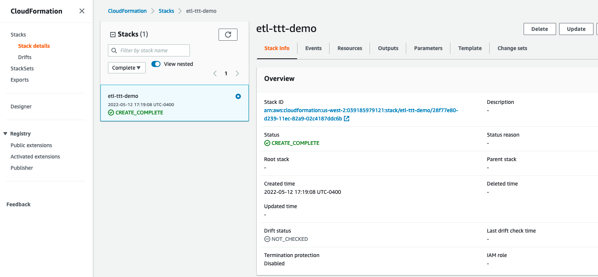

<h1 id="toc_0" align="center">
DEPLOY CLOUDFORMATION TEMPLATE
</h1>

We will use **CloudFormation** to set up the **AWS environment** for the labs. **AWS CloudFormation** is a service that gives developers and businesses an easy way to create a collection of related **AWS and third-party resources**, and provision and manage them in an orderly and predictable fashion. 

We will create one **CloudFormation stack which includes all the resources** we will be using in the following labs.

When you finish all labs, please be sure to **delete the stack** as per the **Clean up section** to avoid unnecessary usage charges.

[Click here to launch Workshop Cloudformation](https://console.aws.amazon.com/cloudformation/home?#/stacks/new?stackName=etl-ttt-demo&templateURL=https://ee-assets-prod-us-east-1.s3.amazonaws.com/modules/31e125cc66e9400c9244049b3b243c38/v1/cloudformation/Personal-Account-Oficial-ETL-TTT-Template.yaml)

Click **Next** in **Create stack** screen, accept the default stack name ***etl-ttt-demo*** in **Specify stack details** screen and click **Next**.  

Click **Next** in **Configure stack options** screen, check the checkbox next to ***I acknowledge that AWS CloudFormation might create IAM resources with custom names***. and click **Create stack**.

You should see a new **CloudFormation stack** with the name ***etl-ttt-demo*** being created. Wait for the status of the stack to be **CREATE_COMPLETE** before moving on.

You can click on the **stack name** and go to **Resource tab** to check what **AWS resoures** were created as part of the **CloudFormation stack**. You should expect to **wait approximately 10 minutes** for the stack to move to the **CREATE_COMPLETE** state.

