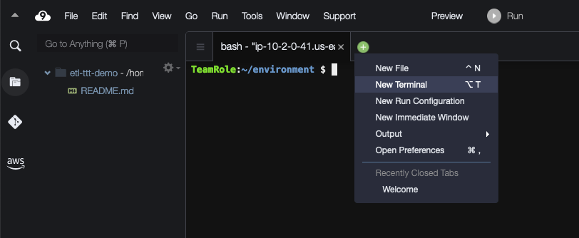

<h1 id="toc_0" align="center">
PREPARING THE CLOUD9 ENVIROMENT
</h1>

We will use AWS Cloud9 to run shell commands, edit and run Python scripts for the labs. Cloud9 is a cloud-based integrated development environment (IDE) that lets you write, run, and debug your code with just a browser. It combines the rich code editing features of an IDE such as code completion, hinting, and step-through debugging, with access to a full Linux server for running and storing code.

Go to the [ADD CLOUD9 LINK HERE] AWS Cloud9 Console in your environment and you should see a Cloud9 Enviroment named "etl-ttt-demo". Select this enviroment and click on the View details button.

Under EC2 Instance, click on Go To Instance link. This will open a new tab on your browser and take you to the AWS EC2 Console. TIP: Leave the AWS Cloud9 Console tab open for now!

In the AWS EC2 Console, select the Cloud9 EC2 Instance that starts with "aws-cloud9-". Click on the Actions dropdown button, followed by Security, then click on Modify IAM Role! 

In the next screen's dropdown box select the role that contains "-AWSEC2InstanceProfileTTT-" and click Save. TIP: You can close the AWS EC2 Console tab now!

 <!-- need another picture with the TTT in the name -->

Go back to the AWS Cloud9 Console tab and, while still on the Enviroment Details page, click on the Open IDE button to launch your AWS Cloud9 IDE environment. Tip: Now, you can close the AWS Cloud9 Console tab.

Allow for the launched AWS Cloud9 Enviroment's setup to finish, then close the Welcome tab and click on the green plus icon (+) to add a New Terminal tab. This will create a new tab and load a command-line terminal.

From now on, you will use this terminal window throughout this workshop lab to execute all the AWS CLI commands and scripts. TIP: Keep this tab open!

#### **1.** Setting up Cloud9 Environment Variables  

[EXPLAIN WHAT GETS CREATED IN THIS LAB]
During the workshop environment setup, a S3 bucket is created for storing lab files and CloudTrail logs. Copy following command to Cloud9 terminal window to get your lab S3 bucket name to ${BUCKET_NAME}. Please save the ${BUCKET_NAME} value, you will be using it through out the workshop.

[detail more what we are doing below]

~~~shell
 AWS_ACCOUNT_ID=`aws sts get-caller-identity --query Account --output text`
 AWS_REGION=`aws configure get region`
 BUCKET_NAME=etl-ttt-demo-${AWS_ACCOUNT_ID}-${AWS_REGION}
 mysqlendpoint=$(aws cloudformation describe-stacks --query 'Stacks[*].Outputs[?OutputKey==`MySQLEndpoint`].OutputValue | [0] | [0]' --output text)
 echo "export BUCKET_NAME=\"${BUCKET_NAME}\"" >> /home/ec2-user/.bashrc
 echo "export AWS_REGION=\"${AWS_REGION}\"" >> /home/ec2-user/.bashrc
 echo "export AWS_ACCOUNT_ID=\"${AWS_ACCOUNT_ID}\"" >> /home/ec2-user/.bashrc
 echo ${BUCKET_NAME}
 echo ${AWS_REGION}
 echo ${AWS_ACCOUNT_ID}
 echo $mysqlendpoint  
~~~ 

<<<<< write the right stuff

[EXPLAIN WHAT THIS COMMAND WILL DO...]

BLAH BLAH BLAH .... The following commands will download and unzip the lab files to your Cloud9 environment, download and zip the 3rd party Python library, upload lab files to your S3 bucket, then copy the COVID-19 dataset to your S3 bucket.
We will use data from a public COVID-19 dataset curated by AWS. We will show details about how to access and exchange data on AWS platform Access COVID-19 Dataset. If you are interested in learning more about this COVID-19 dataset, read this AWS blog
for more information. The 3rd party Python library is from github
and you could find details about the library there. BLAH BLAH BLAH...

<<<<<<

#### **2.** Switching Cloud9 Role Credentials  

[DISABLE AWS CREDENTIALS FROM CLOUD 9 CONFIG]

After running the first set of commands, you need to disable the auto management of AWS Temporary Credentials wich is controled by Cloud9 by default. In your Cloud9 Enviroment click on the Preferences (Gear Icon on the far top right), the Preferences tab will open. There, scroll to AWS Settings and disable the option "AWS managed temporary credentials. 

Once done, close the Preferences tab and in your Cloud9 terminal tab run the following commands to validate that Cloud9 is now using the AWSEC2ServiceRole-etl-ttt-demo role which belongs to the "AWSEC2InstanceProfileTTT" you setup earlier in for the Cloud9 EC2 instance. 

~~~cli
aws sts get-caller-identity
aws configure set region $AWS_REGION
aws configure get region
aws sts get-caller-identity --query Arn | grep AWSEC2ServiceRole-etl-ttt-demo -q && echo "IAM role valid" || echo "IAM role NOT valid"
~~~
You should see your current region and a message "IAM role valid" in the output.

#### **3.** Setting up Security Required Groups Inbound Rules  

Next, a new Inbound Rule will be added to the Default Security group for this workshop which is tagged with the name "etl-ttt-demo" Security Group. This new Inboud Rule is to allow traffic from the AWS Cloud9 Instance's Security Group to the resources in the "etl-ttt-demo". Run the following commands to do that:

~~~shell
ref_sg=$(aws ec2 describe-security-groups --query 'SecurityGroups[?contains(GroupName, `aws-cloud9-etl-ttt-demo`) == `true`].GroupId' --output text)
target_sg=$(aws ec2 describe-security-groups --query 'SecurityGroups[?contains(GroupName, `DefaultVPCSecurityGroup`) == `true`].GroupId' --output text)
aws ec2 authorize-security-group-ingress --group-id $target_sg --protocol -1 --source-group $ref_sg
echo "Source SG:" $ref_sg "has been added to Target SG:" $target_sg
~~~

You should see a message " Source SG: sg-XXXXX has been added to Target SG: sg-XXXXX " where XXXXX are the IDs of both, EC2's and DefaultVPC's Security Group.

[Optional]: You can go to your VPC Console [add link here] to verify that a new Inbound Role has been added to the "etl-ttt-demo", it should have two Inbound Rules now.
 
#### **4.** Installing Required Libraries (Boto3)  

In this next step, BOTO3 Library will be installed to your Cloud9 enviroment. That step is required in order to support running the Kinesis Streaming Python script during the Part 4 - Orchestration & Data Analysis - of this workshop. Run the following command to do so:

~~~shell
sudo pip3 install boto3
~~~
Wait untill you see a message that says: "Successfully installed boto3-1.22.9 botocore-1.25.9 s3transfer-0.5.2"

 
You are finished with the initial setup of the workshop environment. Take some time the explore the commands you ran here and to check the resources (such as the workshop's bucket: etl-ttt-demo-${AWS\_ACCOUNT\_ID}-${AWS_REGION} ) that have been created for you as part of the CloudFormation Template execution. Once you are ready you can move on to Part 1 - Working with TPC-DS Data & RDS MySQL Database!
