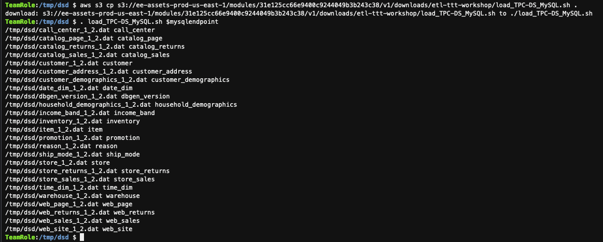
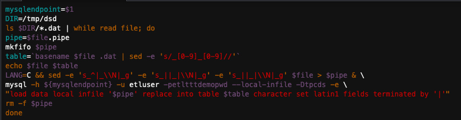
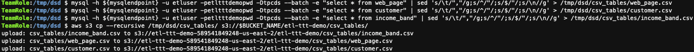

<h1 id="toc_0" align="center">
WORKING WITH TPC-DS DATA & RDS MYSQL DATABASE
</h1>

Welcome to Part 1!

In the Part 1 - Working with TPC-DS Data & RDS MySQL Database - you will be installing and configuring everything that is required to prepare and load TPC-DS* data into a RDS MySQL Database Instance in order to supply the necessary dataset samples for each piece of the ETL Traine The Trainer Workshop.

#### **1.** Preparing & Generating TPCDS Dataset  

<!-- [ADD QUOTE FOR TPC-DS]  -->

* **TPC-DS** - TPC data is used for a decision support benchmark. When you load this data the schema tpcds is updated with sample data. For more information about the tpcds data, see TPC-DS.

<!-- [ADD QUOTE FOR TPC-DS]  -->

Before you can install and generate TPC-Data, you need to build the necessary folders and download the necessary files. 

Run the following command to create the base level directory for the ETL Train the Trainer Workshop and to download the TCP-DS tool to your local AWS Cloud9 Enviroment

~~~shell
mkdir -p ~/environment/ttt-demo
cd ~//environment/ttt-demo//
aws s3 cp s3://ee-assets-prod-us-east-1/modules/31e125cc66e9400c9244049b3b243c38/v1/downloads/etl-ttt-workshop/16d7423c-23d3-4185-8ab4-5b002ec51153-tpc-ds-tool.zip tpc-ds-tool.zip
~~~

Next, run the following commands to unzip the previous downloaded (.zip) file and get into the DSGen software's directory to install the tool.
<<<<<<

~~~shell
unzip tpc-ds-tool.zip 
cd DSGen-software-code-3.2.0rc1/tools/
make
head -200 tpcds.sql 
~~~

The last command (head) prints out the TPC-DS sql script for the tables' schemas to validate the instalation of the tool.

Now, let's run the DSGen software to generate the sample data for all the TPC-DS tables and store the sample datasets in a temporary directory. TIP: This should take about 3 minutes to complete!
<<<<<<

~~~shell
mkdir -p /tmp/dsd/csv_tables/
./dsdgen -scale 1 -dir /tmp/dsd -parallel 2 -child 1
cd /tmp/dsd/
ls -lrt
~~~

[OPTIONAL STEP] -  Performing this optional step should allow for enough time for the previous step to complete!

<<< write the right stuff
While the above command is running, you can proactively test the reacheability of your RDS MySQL Database Instance for access coming from your AWS Cloud9 Enviroment. To do that, run the following command in a NEW terminal tab:

~~~shell
sudo yum -y install telnet
mysqlendpoint=$(aws cloudformation describe-stacks --query 'Stacks[*].Outputs[?OutputKey==`MySQLEndpoint`].OutputValue | [0] | [0]' --output text)
telnet $mysqlendpoint 3306
~~~

TIP: Close this additional Terminal tab once Telnet command succeed!

#### **2.** Populating the Amazon RDS-MySQL Database with TPCDS Dataset  

Once the dataset samples get generated, it is time to load the data into the RDS MySQL Database. But first, run the following commands to create the TPC-DS tables' schemas in the MySQL database:

~~~shell
tpcds_script_path=~/environment/ttt-demo//DSGen-software-code-3.2.0rc1/tools/tpcds.sql 
mysql -h ${mysqlendpoint} -u etluser -petltttdemopwd -Dtpcds < $tpcds_script_path
mysql -h ${mysqlendpoint} -u etluser -petltttdemopwd -Dtpcds -e "show tables"
~~~

The last output should be a list of all the tables that have been created in the database.

Now, it is time to load the data into the tables. To easily do that, you can run the following commands to download and run the a Shell script that does all the loading process into the RDS MySQL Database:

~~~shell
aws s3 cp s3://ee-assets-prod-us-east-1/modules/31e125cc66e9400c9244049b3b243c38/v1/downloads/etl-ttt-workshop/load_TPC-DS_MySQL.sh .
. load_TPC-DS_MySQL.sh $mysqlendpoint

mysql -h ${mysqlendpoint} -u etluser -petltttdemopwd -Dtpcds -e "delete from customer where c_customer_sk > 1000";
mysql -h ${mysqlendpoint} -u etluser -petltttdemopwd -Dtpcds -e "commit"; 
~~~

NOTE: Observe that for this workshop's purposes only, once the loading process is done a SQL Delete Statement is performed in order to delete multiple rows of the customer table since this table is too big originally.

You can see all the tables getting loaded one by one...

And here's a snippet of the Shell Script code (You don't need to create it!):

#### **3.** Unloading Tables (in CSV) from RDS MySQL Database and Uploading to S3

Finally, running the following commands will:

- Extract the 3 required tables (web\_page, customers and income\_band) from the MySQL database;
- Save these tables in the local temporary directory (in CSV format);
- And, subsequently, upload these CSV files into the Workshop's S3 Bucket's path: " .../etl-ttt-demo/csv_tables/ "

~~~shell
mysql -h ${mysqlendpoint} -u etluser -petltttdemopwd -Dtpcds --batch -e "select * from web_page" | sed 's/\t/","/g;s/^/"/;s/$/"/;s/\n//g' > /tmp/dsd/csv_tables/web_page.csv
mysql -h ${mysqlendpoint} -u etluser -petltttdemopwd -Dtpcds --batch -e "select * from customer" | sed 's/\t/","/g;s/^/"/;s/$/"/;s/\n//g' > /tmp/dsd/csv_tables/customer.csv
mysql -h ${mysqlendpoint} -u etluser -petltttdemopwd -Dtpcds --batch -e "select * from income_band" | sed 's/\t/","/g;s/^/"/;s/$/"/;s/\n//g' > /tmp/dsd/csv_tables/income_band.csv
aws s3 cp --recursive /tmp/dsd/csv_tables/ s3://$BUCKET_NAME/etl-ttt-demo/csv_tables/
~~~

 
You are finished populating the RDS MySQL Database with TPC-DS sample data. Now, feel free to explore the workshop's bucket again ( etl-ttt-demo-${AWS\_ACCOUNT\_ID}-${AWS_REGION} ) and check the files insite the "etl-ttt-demo/csv_tables" path. Once you are ready you can move on to Part 2 - AWS GLUE COMPONENTS!