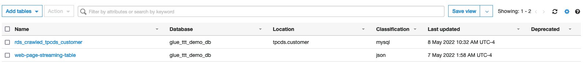

<h1 id="toc_0" align="center">
AWS GLUE DISCOVERY COMPONENTS
 
(Databases, Tables, Connections, Crawlers And Classifiers)
</H1>

Welcome to Part 2!

In the Part 2 - AWS Glue Discovery Componets - of this ETL Train The Trainer workshop, you will understand the AWS Glue Data Catalog and all the Glue resources associated with it.

At first, you will explore all the Glue resources created for you as part of the CloudFormation. Then, you will create and run couple more Glue Resources that will be required for the subsequent parts of the workshop.

The Glue components that you work with during this lab include Glue Databases, Tables, Connection, Crawlers and Classifiers.

#### **1.** Understanding the Glue Resources Provided (CloudFormation Resources)

To browse through all the Glue provided resources first go to the AWS Glue Console <ADD LINK>. In the far left menu of the AWS Glue Console you can access all your resources like Database, Tables, Crawlers, Jobs, etc.

**Databases**

Definition: A database is a set of associated table definitions, organized into a logical group.

To see all your databases, click on Databases. There, you should see 2 databases, the Default - which, as the name suggests, is the default database for Glue in this region - and the "glue_ttt_demo_db" which is the database where you will be creating and storing all the workshop's tables metadata for all the labs.

**Tables**

Definition: A table is the metadata definition that represents your data, including its schema. A table can be used as a source or target in a job definition.

To see all your databases, click on Tables, under Databases. There, you should see just one table named "web-page-streaming-table". This table has been created as part of the CloudFormation template and you will explore this table in details in the subsequent Part 3 - Glue Streaming Lab of this workshop.

**Connections**

Definition: A connection contains the properties needed to connect to your data.

To see all your connections, click on Connections, under Databases. There, you should see only one connection named "rds-mysql-connection" which we will explore and test in the next step of this lab.

**Crawlers**

Definition: A crawler connects to a data store, progresses through a prioritized list of classifiers to determine the schema for your data, and then creates metadata tables in your data catalog.

To see all your crawlers, click on Crawlers. There, you should see 2 crawlers which were created as part of the CloudFormation template:

&nbsp;&nbsp;&nbsp;&nbsp;&nbsp; - *ml_bootstrap_crawler*: This crawler is to bootstrap a table that is required for the Part 5 - Machine Learning with Glue & Glue Studio Notebooks. You will explore it later.  
&nbsp;&nbsp;&nbsp;&nbsp;&nbsp; - *mysql-rds-crawler*: This crawler is to crawl RDS MySQL customer's table. It uses a the above Glue Connection reach the RDS MySQL database instance. You will explore it in the next step.

**Classifiers**

Definition: A classifier determines the schema of your data. You can use the AWS Glue built-in classifiers or write your own.

To see all your classifiers, click on Classifiers, under Crawlers. There is no classifiers created yet but you will be creating one in the third step step of this lab.
	

#### **2.** Testing and running pre-created Glue Resources (Glue Connection & Glue Crawler for MySQL RDS)

Now, let's run a Crawler and verify the tables it will create. But first, let's confirm that the connection that the crawler is going to use is working properly.

Click on Connections, then click on the blue name "rds-mysql-connection" to open the details of that connection.

You can see that the connection has a JDBC URL that points to the "tpcds" database that you created earlier in the RDS MySQL. The JDBC URL uses the RDS instance's endpoint. The connection also has the right VPC and Subnet configured as well as a Security Group. 

Note 1: As part of the CloudFormation template, this security has been added to an Inboud Rule at the RDS Instance's Security Group which allows traffic on port 3306 (MySQL's default port) of the RDS instance.

Click on Connections again, then check "rds-mysql-connection" connections box and click on Test Connection button.

In the pop-up screen, choose the required IAM Role to perform the connection test ("AWSGlueServiceRole-etl-ttt-demo"). Finally, click on Test Connection.

Note 2: The AWSGlueServiceRole-etl-ttt-demo has been created as part of CloudFormation template and has all the required permissions for all the labs in this workshop.

While the connection test is running, you will notice the following banner at the:

You don't need to wait for it to finish, you can now click on Crawlers and start exploring the "mysql-rds-crawler" by click on its blue name.

As you can see, this crawler uses the aforementioned Glue Connection to crawl the path "tpcds/customer" which is the database/table that you created and loaded data earlier. From this screen, just click on Run Crawler at the top.

By starting this crawler, you will notice its Status column progressing from Ready -> Starting -> Xmin elapsed -> Stopping -> Ready again. 

TIP: This crawler should take about 2-3 minutes to complete so move to the next lab then come back in 3 minutes to verify the results of running the crawler!

At this point, the previous connection test should have already succeeded. You will see a green banner at top saying "rds-mysql-connection connected successfully to your instance.". At crawler's successfull completion, you should also see, in the Tables added column, that 1 table has been added. 

Go to Databases > Tables on the left to check the 1 table created. You will see that, apart from the streaming table, there will be another table named "rds\_crawled\_tpcds\_customer" created in the "glue\_ttt\_demo\_db" in which Location says "tpcds.customers" and Classification says "mysql".

Explore this table by clicking on its blue name.

  <!-- NEED A NEW PICTURE HERE -->

<!-- NEED TO TALK A BIT ABOUT THIS TABLE GENERATED FROM RDS -->

#### **3.** Creating new Glue Resources (New Crawler & Classifier)

While the above "mysql-rds-crawler" is running (if you followed the previous tip), it is time to create couple more resources in Glue. First is a Glue Custom CSV Classifier.

**Create Classifier**

To create a classifier, click on Classifiers in the far left menu, then click on Add Classifier. Fill out the details with the following details:

Classifier name: My-Custom-CSV-Classifier  
Classifier type: CSV
Column delimiter: Comma (,)  
Quote symbol: Double-quote (")  
Column headings: Has headings  
(headings list): c\_full\_name,c\_email\_address,total\_clicks  

Click on the Create button at the bottom of pop-up page. A new classifier will be added to the list of classifiers.

**Create Crawler**

Next, as an advanced step, you are going to create a new crawler to crawl the path of the future Glue Streaming job's output that you will still develop in Part 3 - Glue (Studio) Streaming.

To create a crawler, click on Crawlers in the far left menu, then click on Add Crawler. Fill out the details on each screen as following details:

&nbsp;&nbsp;&nbsp;&nbsp;&nbsp; **1.** On Add information about your crawler page, provide a name for the new Crawler such as "crawl\_streammed\_data". Then, expand the option that says "Tags, description, security configuration, and classifiers (optional)" and scroll to the bottom to see the list of custom classifiers on the right. Click on Add in front of "My-Custom-CSV-Classifier". It will appear on the left side as well now. Click Next.
  
&nbsp;&nbsp;&nbsp;&nbsp;&nbsp; **2.** On Specify crawler source type page, simply click Next. 
 
&nbsp;&nbsp;&nbsp;&nbsp;&nbsp; **3.** On Add a data store page, under Include path, pick "s3://\${BUCKET_NAME}/etl-ttt-demo/output/gluestreaming/total\_clicks/" . Make sure you pick the csv folder rather than the file inside the folder, and then click Next.

TIP: Switch back quickly to your Cloud9 enviroment in order to get the full path above by running the following command:

~~~shel
echo s3://${BUCKET_NAME}/etl-ttt-demo/output/gluestreaming/total_clicks/
~~~

&nbsp;&nbsp;&nbsp;&nbsp;&nbsp; **4.** Still on Add a data store page, under Sample Size (optional) choose 1. Then, expand where it says "Exclude patterns (optional)" and in the Exclude patterns field add: **00001

&nbsp;&nbsp;&nbsp;&nbsp;&nbsp; **5.** On Add another data store page, choose No and click Next.
 
&nbsp;&nbsp;&nbsp;&nbsp;&nbsp; **6.** On Choose an IAM role page, click Choose an existing IAM role and pick the role "AWSGlueServiceRole-etl-ttt-demo", then click Next.

&nbsp;&nbsp;&nbsp;&nbsp;&nbsp; **7.** On Create a schedule for this crawler page, click Next.

&nbsp;&nbsp;&nbsp;&nbsp;&nbsp; **8.** On Configure the crawler's output page, choose "glue\_ttt\_demo\_db" from the Database dropdown list. Then, expand where it says "Grouping behavior for S3 data (optional)" and check the box "Create a single schema for each S3 path". Click Next.

&nbsp;&nbsp;&nbsp;&nbsp;&nbsp; **9.** Review everything in the last page and click Finish.

<h4 id="toc_0" align="center"> !!! DO NOT RUN THIS CRAWLER YET!!!! </h4>

 
You are finished populating reviewing and setting up new Glue Resources. Once you are ready you can move on to Part 3 - Glue (Studio) Streaming!