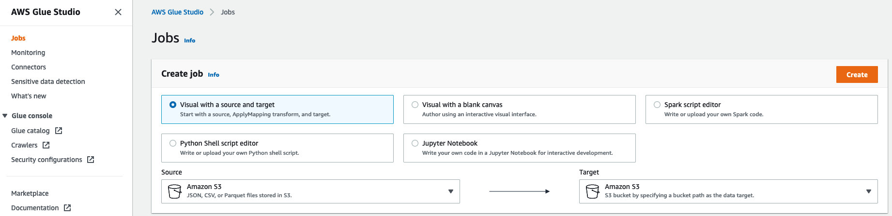

<h1 id="toc_0" align="center">
GLUE (STUDIO) STREAMING</h1>

The **Part 3 - Glue (Studio) Streaming -** of the **ETL Train the Trainer workshop** is where you are going to use **AWS Glue Studio Graphical Interface** for the first time.

You are going to use **Glue Studio** do build 2 jobs here. The first job is a *dummy* Glue Streaming Job that will validate the JOIN between the **customer** RDS table and a **web_page** CSV data that you uploaded earlier to S3. 

**Note:** This CSV data is basically a representation of the actual **web-page-streaming-table** (with the different of that one being in JSON format) that you will use in real Glue Streaming Job

Apart from validate the **JOIN** between datasets, this *dummy* job will also validate the SQL code used in the **SQL Transform node** of this lab. If validation succeeds, you will then be able to **Preview the Data** before outputting it or, in this case, before building the real **Glue Streaming Job**.

#### **1.** Understanding the Streaming Resources Provided (CloudFormation & Scripts)

For this lab to work, the CloudFormation template provided few resources for you already.

**Kinesis Data Stream**

A Kinesis Data Stream named **etl-ttt-demo-stream** has been added already which will receive the stream of data from a script you will run later on this lab. Click [here](http://console.aws.amazon.com/) to search for **Amazon Kinesis** and explore the **Kinesis Data Stream** if you want.

**Cataloged Streaming Table**

As you already saw it, a table named **web-page-streaming-table** has been created for you with a proper schema definition and all the necessary settings. You can see the details of this table in the **AWS Glue Console** <link>.

Here's a snapshot of that table's schema.

**Kinesis Data Ingestion Script (python)**

As mentioned, you will be running the following script in order to simulate streaming data being added to your Kinesis Data Stream **etl-ttt-demo-stream**

To download the script (and to take a loot at it), run the following commands:

~~~shell
cd ~/environment/ttt-demo/
aws s3 cp s3://ee-assets-prod-us-east-1/modules/31e125cc66e9400c9244049b3b243c38/v1/downloads/etl-ttt-workshop/PutRecord_Kinesis.py .
cat PutRecord_Kinesis.py
~~~

<!--
**RDS MySQL Customer Table**

For the **Part 3 only of this workshop**, you need to delete multiple rows from the **RDS MySQL's customer table**. That's because the **customer** is too big originally so **previewing** such amount of data with **Glue Studio Data Preview** feature is **inneficient and may fail**.

Run the following **SQL Delete Statement** to reduce the table to only **1000 rows**:

~~~shell
mysql -h ${mysqlendpoint} -u etluser -petltttdemopwd -Dtpcds -e "delete from customer where c_customer_sk > 1000";
mysql -h ${mysqlendpoint} -u etluser -petltttdemopwd -Dtpcds -e "commit"; 
~~~

-->

 
#### **2.** Validating Streaming Job Logic and Data (Glue Studio Dummy Job)

Let's start building the **dummy** job to validate our Glue Streaming Job logic.

From the **AWS Glue Console**, click on **AWS Glue Studio** under the **ETL** section in the far left menu.

 

This will take you to the AWS Glue Studio Console where you will be authoring the jobs graphically. For that, click on **Jobs** on the far left menu, select **Visual with a blank** canvas option and click on **Create**.

You will be presented with a blank canvas. The first thing you must do there is to rename you job. Just click where it says **"Untitled job"**
, type `dummy-streaming-job` and click out the **Job's** name box.

Now, the next thing you must do, is to set your jobs detail. Click on the tab **Job details** tab and set the following configurations:

- Under **IAM role** select **AWSGlueServiceRole-etl-ttt-demo**
- Check the **Automatically scale the number of workers** option (GA regions only, otherwise set **number of workers** to **4**)
- Under **Job bookmark** select **Disable**
- Set **Number of retries** to **0**

Note: In production environments, you want to enable the bookmark and set retries to bigger than 0.

You don't need to change any other settings here, but you should take some time to explore what settings are available in this tab. When you are done exploring, click **Save** on the upper right to save the changed settings.

Click the **Visual** tab again to go back to visual editor. You should see 3 dropdown buttons: **Source**, **Transform**, and **Target**. Let's start creating the following 2 sources:

**Web Page Source**

For the **Web Page CSV** source, click on the **Source** dropdown icon and choose **Amazon S3** in dropdown list. Click on the node that has been automatically added to the canvas to highlight it. Make the following changes to it:

- Click **Node properties** tab
 - Set **Name** to `Web Page S3`
- Click **Data source properties - S3** tab
 - Under **S3 source type** select **S3 location**
 - To set the **S3 URL**, use the **Browse S3** button to navigate to: ***s3://${BUCKET\_NAME}/etl-ttt-demo/csv\_tables/web\_page.csv***
 - Uncheck the **Recursive** option
 - Click **Infer schema** button at the bottom
 - Click on **Output schema** tab to see schema infered, then click **Save**
    

**Customer RDS Source**

For the **Customer RDS** source, click on the **Source** dropdown icon and choose **AWS Glue Data Catalog** in the dropdown list.

- Click **Node properties** tab
 - Change Name to `Customer RDS`
- Click **Data source properties - Data Catalog** tab
	- Under **Database** select **glue\_ttt\_demo\_db**
	- Under **Table** select **rds\_crawled\_tpcds\_customer**
 - Click on **Output schema** tab to see schema, then click **Save**

<!-- [SHOW THE CONNECTION IN GLUE AND SHOW CUSTOM CONNECTOR - SEE WHAT'S BETTER - MENTION MARKETPLACE CONNECTORS] -->

To join both datasets, click on the **Web Page S3** node first to highlight it, then click on **Transform** dropdown icon.

Note: You will notice there are pre-build transformations and custom transformations. Glue Studio is designed to be used by developers who could write custom **Apache Spark, Glue and SQL code**, but it also provides pre-build common transformations. For this lab you wil lbe using a custom SQL Transform to write your own SQL Join code.

In the list of transforms that appears, scroll to the bottom and choose **SQL**. A new **SQL** node will be linked to the **Web Page S3** node. Click on this new **SQL** node to highligt it and do the following:

- Click **Node properties** tab
 - Under **Node parents**, select **Customer RDS** by clicking the checkbox next to it
- Click **Transform tab**
	- Set Input sources **Web Page S3** with **Spark SQL aliases** value to `wp`
	- Set Input sources **Customer RDS** with **Spark SQL aliases** value to `cust`
	- Copy the following code to SQL query and click **Save**

~~~sql
select CONCAT(cust.c_first_name, ' ', cust.c_last_name) as full_name,
cust.c_email_address,
count(wp.wp_char_count) as total_clicks
from cust
left join wp
on cust.c_customer_sk = wp.wp_customer_sk where 1=2 --remove the where clause after preview!!
group by 1,2
order by total_clicks desc
~~~

> IMPORTANT: Save the job right now and go back to Glue Studio main screen. Then, reopen the job. This is required for the assets required for this job to get properly saved which includes the RDS Connection that is part of the job and doesn't get loaded properly if that step is not followed which causes Data Preview to fail!

- Click on **Data Preview** tab
	- Click on the **Start data preview session** button there.
	- In the pop-up window that will open, choose the IAM role **AWSGlueServiceRole-etl-ttt-demo**
	- Wait for **Data Preview** to finish (it takes about 2 minutes to preview)
		- Once preview is completed, Click on **Output schema** tab to see the schema.
		- Click on the **Use datapreview schema** button that you see right there in the **Output schema** tab.

Note that the schema now matches only the relevant columns brought from the SQL query. Click **Save**.

Now, add an **Apply Mapping** transform by clickinng on the **SQL** node first to highlight it, then click on **Transform** dropdown icon and choose **Apply Mapping** from the list.

A new **Apply Mapping** node will be linked to the **SQL** node. Click on this new **Apply Mapping** node to highligt it and do the following:

- Click on **Transform** tab
 - Change Source key **full_name** to **c\_full\_name**
 - Click on **Output schema** tab to see the change and **Save**.
 

 
Finally, add a **Target** to the job. To do this, first click on the **Apply Mapping** node to highlight it, then click on **Target** dropdown, choose **Amazon S3** from the list and a new **Amazon S3** node will be linked to the **Apply Mapping** node. 

Click on this new **Amazon S3** node to highligt it and do the following:

- Click on **Data target properties - S3** tab
 - Set **Format** to **CSV**
 - Set **S3 Target Location** to *s3://$BUCKET\_NAME/etl-ttt-demo/output/gluestreaming/total\_clicks/*

TIP: Switch back quickly to your Cloud9 enviroment and use the following command to build the entire path you need for the **S3 Target Location** above.

~~~shell
echo "s3://$BUCKET_NAME/etl-ttt-demo/output/gluestreaming/total_clicks/"
~~~

 - Click **Save**. 

<h4 id="toc_0" align="center"> !!! You can now save this job for the last time but DO NOT RUN IT!!!! </h4>

#### **3.** Creating the Glue Streaming Job (Cloning Jobs!)

Go back to **Jobs** in the **Glue Studio** left menu and, under **Your jobs** select the *dummy-streaming-job*  (or any clone of it). Click on the **Actions** dropdown button and choose **Clone Job**.

The visual canvas will open and you will notice that the cloned job contains the exact same nodes with the exact same definitions you choose for the *dummy* job. Rename this new job to `glue-streaming-job` and **Save** it.

Now, all you have to do is:

&nbsp;&nbsp;&nbsp;&nbsp;&nbsp; **1.** Remove the **Web Page S3** by clicking on it to highlight it first, then clicking on **Remove** (trash icon)   

&nbsp;&nbsp;&nbsp;&nbsp;&nbsp; **2.** click on the **Source** dropdown icon and choose **Amazon Kinesis** in dropdown list. A new and isolated **Amazon Kinesis** node will appear.

&nbsp;&nbsp;&nbsp;&nbsp;&nbsp; **3.** Click on the new **Amazon Kinesis** node to highlight it, go to **Node Properties** tab and name it `Web Page Stream` .  

&nbsp;&nbsp;&nbsp;&nbsp;&nbsp; **4.** Click on **Data source properties - Kinesis Stream** tab and under **Amazon Kinesis Source** choose **Data Catalog table**. Then, under **Database** choose **glue\_ttt\_demo\_db** and under **Table** choose **web-page-streaming-table**.  

&nbsp;&nbsp;&nbsp;&nbsp;&nbsp; **5.**  Uncheck **Detect Schema**, set **Starting position** to **Latest** and set **Window size** to **60**. Click **Save**

&nbsp;&nbsp;&nbsp;&nbsp;&nbsp; **6.** Now, click on the **SQL** join node at the center of the canvans to highlight it. Go to **Node Properties** tab and under **Node parents** check the **Web Page Stream** node to complete the **Join**.

&nbsp;&nbsp;&nbsp;&nbsp;&nbsp; **7.** Click on the **Transform** tab and fix the **SQL aliases** for the **Amazon Kinesis Input Source** by typing **wp** there to match the alias in the **SQL query**. Click **Save**.

<!--

<h4 id="toc_0" align="center"> !!! !!! DO NOT RUN THIS JOB YET !!! !!! </h4>

Before running this job, go back to your **Cloud9 Enviroment** tab and run the following commands to repopulate the **RDS MySQL's customer table**:

~~~shell
cd /tmp/dsd/
file=customer_1_2.dat
mysql -h ${mysqlendpoint} -u etluser -petltttdemopwd --local-infile -Dtpcds -e "truncate table tpcds.customer"

mysql -h ${mysqlendpoint} -u etluser -petltttdemopwd --local-infile -Dtpcds -e \
"load data local infile '$file' replace into table tpcds.customer character set latin1 fields terminated by '|'"

mysql -h ${mysqlendpoint} -u etluser -petltttdemopwd --local-infile -Dtpcds -e "select count(*) from tpcds.customer"
~~~

You should have **100.000** rows in the **customer** table now.
-->

Now, you are free to run the **Glue Streaming Job**. Click **Run** and a green banner will appear at the top with a message **"Successfully started job glue-streaming-job. Navigate to Run Details for more details."**. Click on **Run Details** to confirm that the job is indeed **Running**. 

**TIP:** You can delete the *dummy* job now (Once you validate the data previewed previously).

 

You have finshed **creating & running a Glue Streaming Job**. At this point, there's no data being pushed into the **Kinesis Data Stream source** of this job. Once you are ready move to the **Part 4 - Orchestration & Data Analytsis** where you will start to push data into the **Kinesis Stream**.

