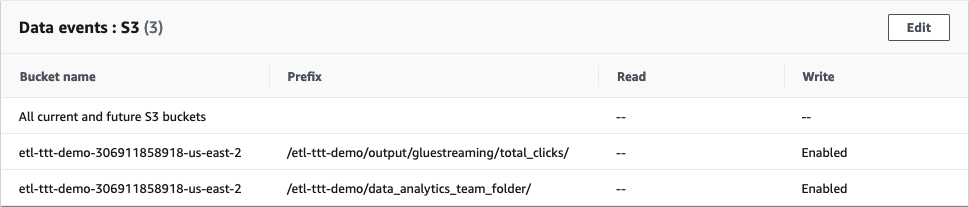

<h1 id="toc_0" align="center">
ORCHESTRATION & DATA ANALYSIS</h1>

In the **Part 4 - Orchestration & Data Analysis -** of this workshop you will combine the forces of **AWS CloudTrail, Amazon EventBridge, AWS Glue Workflows and Amazon Athena** to orchestrate the entire data pipeline - from the streaming of **JSON data** until the **query analysis in Amazon Athena**.

#### **1.** Understanding the Orchestration Flow

To understand the Orchestration flow, first you need to take a look at the pre-created resources you havefrom the CloudFormation Template for this lab.

Go to [AWS CloudTrail](https://console.aws.amazon.com/cloudtrail/) console ***(switch to your right region if needed!)*** to explore the Trail created for your named **etl-ttt-demo-trail**

Note that this Trail is monitoring for **write events** for two paths in the **etl-ttt-demo-${AWS\_ACCOUNT\_ID}-${AWS_REGION}** Bucket as you can see in the following picture:

By having such **Trail configuration**, you will be able to leverage **AWS Event Bridge** during this lab to trigger **(Step Function and Glue) Workflows** as soon as streaming data lands in the **trail-enabled S3 Bucket**.

That is possible because once a file lands in this bucket it records a **write event** in the **Trail**. This **write event** further triggers an **EventBridge Rule** which, consequently, cat fire **(Step Functionn and Glue) Workflows**.

#### **2.** Creating Glue Workflow and Glue Event Based Trigger (via CLI)

In this lab, we will create a **Glue Workflow** that will get triggered upon a **write event notification** received by **EventBridge**. This workflow will then initiate a **Crawler** to immediatelly crawl the file that just landed in the **S3 bucket**

So, let's create the **Glue Workflow** followed by a **Glue Trigger**. To do this, go back to your **Cloud9 Enviroment Terminal** and run the following **AWS CLI commands** in sequence.

- First the **Glue Workflow**:

~~~cli
aws glue create-workflow --name etl-ttt-event-driven-workflow
~~~

- Then the **Glue Trigger**:

~~~cli
aws glue create-trigger \
    --workflow-name etl-ttt-event-driven-workflow \
    --type EVENT \
    --name s3-object-trigger \
    --actions CrawlerName=crawl-streammed-data \
	--event-batching-condition "{\"BatchSize\": 2,
	\"BatchWindow\": 900}"
~~~
	

After running both commands, go to the **Glue Console** and click on **Workflows** under the **ETL** section of the **Glue Console's left menu**. You will see a new **Glue Workflow** created there. Click on the **radio button** close to its name to see the workflow in the **Graph Canvans** as bellow:

**Note:** You can also see the **Glue Trigger** in the **Trigger** menu under the **ETL** section.

#### **3.** Creating Event Bridge Rule and Target (via CLI)

Now, let's create the **EventBridge Event Rule** followed by an **EventBridge Event Target** which is, of course, the **Glue Trigger** created in the previous step. Run the following **AWS CLI commands** in sequence to create everything.

- First the **Event Rule**:

~~~cli
aws events put-rule \
    --name "total-clicks-rule" \
    --event-pattern "{ \
                        \"source\": [\"aws.s3\"], \
                        \"detail-type\": [\"AWS API Call via CloudTrail\"], \
                        \"detail\": { \
                            \"eventSource\": [\"s3.amazonaws.com\"], \
                            \"eventName\": [\"PutObject\"], \
                            \"requestParameters\": { \
                                \"bucketName\": [\"${BUCKET_NAME}\"], \
                                \"key\": [{\"prefix\": \"etl-ttt-demo/output/gluestreaming/total_clicks/\"}]
                            } \
                        } \
                    }"
~~~

- Then the **Event Target**:

~~~cli
aws events put-targets \
    --rule total-clicks-rule \
    --targets "Id"="etl-ttt-event-driven-workflow","Arn"="arn:aws:glue:${AWS_REGION}:${AWS_ACCOUNT_ID}:workflow/etl-ttt-event-driven-workflow","RoleArn"="arn:aws:iam::${AWS_ACCOUNT_ID}:role/AWSEventBridgeInvokeRole-etl-ttt-demo" \
    --region ${AWS_REGION}
~~~

After running both commands, go to [AWS EventBridge](https://console.aws.amazon.com/events/) console. ***(switch to your right region if needed!)***.

On the left side menu, click on **Rules**, then click on top of the rule **total-clicks-rule** to open its details. You should see under the **Event Pattern** tab the following:

This pattern is basically saying that this **EventRule** is watching for every **PutObject** event that occur in the **bucket/prefix** specified in there.

Click on the **Targets** tab. Here, you can see that the **Target Name** points to the **Glue Workflow** you just created **etl-ttt-event-driven-workflow**. Also that it has a **EventBridge Role**, with all the required permissions, associated with it. This **Role** has also been created as part of the **CloudFormation template**.

#### **4.** Triggering Orchestration & Following The Flow

Now, it is time to push data into the **Kinesis Data Stream**. You will run the **Kinesis Ingestion Python Script** you saw in the previous lab: **Part 3 - Glue (Studio) Streaming -** to push data into the stream. 

To start the script, run the following in the **Cloud9 Enviroment**:

~~~shell
cd ~/environment/ttt-demo/
python PutRecord_Kinesis.py 
~~~

You will start to see data flowing on your **Cloud9 Terminal**, wait for few seconds for this to complete. In the meantime, go back to the **Glue Studio Console** and verify that the **Glue Streaming Job** is still running.

Once the script finishes and you have verified that the **Glue Streaming Job is running**. Go back to the **AWS Glue Console** and look for your workflow. Refresh the **Workflows** screen and select your **etl-ttt-event-driven-workflow**. 

*(it may take couple of minutes for data to land in the buckect, just wait and keep refreshing at every 15 seconds!)*

Then click on the **History** tab at the bottom of the page, select the **Run ID** you see there and click on **View run details** button to see the workflow *flowing*:

While the workflow is running, you can check the **Glue Crawler** that the workflow is triggering. You can also go to you **S3 Bucket** and see the files that were generated there by the **AWS Glue Streaming Job** which was sent from the **Kinesis Data Stream** (after running the **Kinesis Ingestion Script**):

**Running Crawler's name**: **`crawl_streammed_data`**  
**Streaming Job's target path**: **`s3://etl-ttt-demo-${AWS\_ACCOUNT\_ID}-${AWS_REGION}/etl-ttt-demo/output/gluestreaming/total_clicks/`**

**NOTE:** To keep this workflow from getting trigger multiple times, **delete it now as you don't need it anymore!**

<!--  maybe try cli to EDIT THE TRIGGER TO 100 SO IT STOP RUNNING AT EVERY BATCH OF STREAMING DATA] -->

#### **5.** Exploring and Analyzing Table's Data Cataloged in Glue Data Catalog

Once the workflow completes, you will noticed that the **Crawler** triggered by the workflow actually produced **1 new table**. In the **Glue Console**, go to **Tables** to see a new table named **total_clicks**. *(Feel free to explore this table's details as much as you want!)*

In the **Glue Console's Table** page, click on the checkbox near the **total_clicks** table, then click on the **Action** dropdown button to launch the table in the **Amazon Athena Console**. *(Hit the* ***Preview Button*** *if a pop-up is prompted)*

 

In the **Athena Query Editor Console**, you may see a blue banner at the top that says *"Before you run your first query, you need to set up a query result location in Amazon S3."*. Just click on the **View settings** button you see there, then click on the **Manage** button in the far top right of the page, then click on **Browse S3**. Search for a bucket that starts with **aws-glue-assets-** and select it. Complement this bucket with **`/athena-output/`** and hit **Save**

Click on **Editor** to start running your queries. In the **Query 1** tab, erase everything there, paste and *Run* the following query:

~~~sql
SELECT * FROM "AwsDataCatalog"."glue_ttt_demo_db"."total_clicks" order by 3 desc limit 10;
~~~

You should see the query results at the bottom:

Now, you are going to create a **View** on top of this table to allow for **aggregation** of the underlying files that compose this table's data.

Run the following command to create a view that is meant to select the **Top 5 customers aggregated by their number of clicks** in a particular website: *(That's the* ***web_page*** *streaming data you have captured!)*

~~~sql
CREATE OR REPLACE VIEW "tpc_customer_inter" AS 
SELECT
  "c_full_name"
, "c_email_address"
, "sum"(CAST("total_clicks" AS integer)) total_clicks
FROM
  "total_clicks" 
GROUP BY 1, 2
ORDER BY 3 DESC
~~~

In a new **Query Tab**, run below query to query the view now:

~~~sql
SELECT * FROM "glue_ttt_demo_db"."tpc_customer_inter";
~~~

Note down the results you see:

Now, go back to your Cloud9 Enviroment and run the **Kinesis Ingestion Python Script** again: 

~~~shell
cd ~/environment/ttt-demo/
python PutRecord_Kinesis.py 
~~~

Allow for it to complete and wait for about 30-60 seconds and re-run the last Athena query.

~~~sql
SELECT * FROM "glue_ttt_demo_db"."tpc_customer_inter";
~~~

**Note:** If you noticed that above results hasn't changed. It might be that your calendar **Year, Month, Day, or Hour** has changed (most probably the **Hour**). Run the **crawl_streammed_data** crawler again to **update partitions** or try the **MSCK REPAIR TABLE \`total_clicks\`;** command from within **Athena** itself.

You have reached to the end of this lab. If you want, you can keep pushing more data into your Kinesis Data Stream by running the **Kinesis Ingestion Python Script** multiple times and allowing few seconds each time for the **Glue Streaming Job** to process it. Once you are ready, manually stop the **glue-streaming-job** and move to **Part 5 - Machine Learning with Glue & Glue Studio Notebooks**.

