<h1 id="toc_0" align="center">
MACHINE LEARNING WITH GLUE
  &  GLUE STUDIO NOTEBOOKS
</h1>

Welcome to Part 5!

The **Part 5 - Machine Learning with Glue & Glue Studio Notebooks -** of the **ETL Train The Trainer Workshop** is going to cover the steps required to work with the Glue ML Transforms, more specifically, it will teach you about how to **create**, **train** (with **labeling files**), and **write Glue ETL code** that leverages the **Glue's FindMatches ML Transform** using **Glue Studio Notebooks** that you can further operationalize it into **Glue Jobs**. 

#### **0.** (Pre Steps) - Understading & Setting up the Resources for ML Lab

To begin, you must first run the following commands in your **Cloud9 Terminal** to download the the **ML Lab files** from the **Workshop's default S3 Bucket**.

These commands will:

- Create the local directory structure for this lab in your Cloud9 Environment
- Place each file in its respective folder.
- Re-upload all these files to your own S3 Bucket
- Building the required S3 Bucket Path structure for this lab:

~~~shell
mkdir -p /tmp/dsd/csv_tables/ml-lab/ml-customer-sampling /tmp/dsd/csv_tables/ml-lab/ml-customer-full /tmp/dsd/csv_tables/ml-lab/ml-labeling-file

aws s3 cp s3://ee-assets-prod-${AWS_REGION}/modules/31e125cc66e9400c9244049b3b243c38/v1/downloads/etl-ttt-workshop/ml-customer/sample-customer/sample-top-customer.csv /tmp/dsd/csv_tables/ml-lab/ml-customer-sampling/sample-top-customer.csv

aws s3 cp s3://ee-assets-prod-${AWS_REGION}/modules/31e125cc66e9400c9244049b3b243c38/v1/downloads/etl-ttt-workshop/ml-customer/top-customer/full-top-customer.csv /tmp/dsd/csv_tables/ml-lab/ml-customer-full/full-top-customer.csv

aws s3 cp s3://ee-assets-prod-${AWS_REGION}/modules/31e125cc66e9400c9244049b3b243c38/v1/downloads/etl-ttt-workshop/ml-customer/labeled-customer/top-customer-labeling-file.csv /tmp/dsd/csv_tables/ml-lab/ml-labeling-file/top-customer-labeling-file.csv

aws s3 cp s3://ee-assets-prod-${AWS_REGION}/modules/31e125cc66e9400c9244049b3b243c38/v1/downloads/etl-ttt-workshop/ml-notebook/ml-lab-notebook-job.ipynb /tmp/dsd/csv_tables/ml-lab/ml-notebook/ml-lab-notebook-job.ipynb 

aws s3 cp --recursive /tmp/dsd/csv_tables/ml-lab/ s3://$BUCKET_NAME/etl-ttt-demo/ml-lab/
~~~

For this part of the **ETL Train the Trainer Workshop**, two crawlers have been created for you as part of the **CloudFormation Template**:
 
- The **ml-sample-cust-crawler** will create the **S3-based** table named **ml\_sample-customer** which has much less amount of data but large enough to be used as **sample source data** to train and label the **FindMatches ML Transform** you are going to create next. 

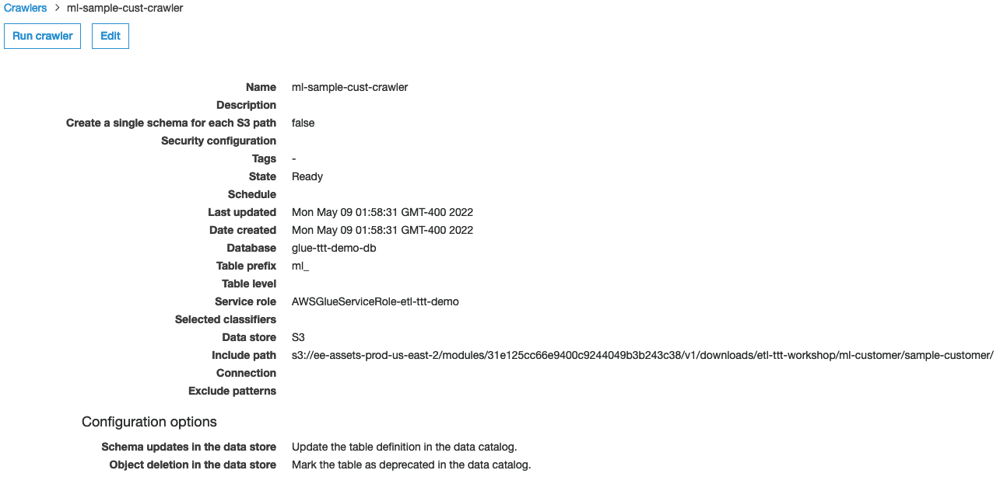

- The **ml-bootstrap-crawler** will create the **S3-based** table named **ml\_dedup\_sample\_customer** which is the **full dataset** that the future **Notebook Job** will try to deduplicate using the **FindMatch ML Transform** that you trained using the smaller **ml\_sample-customer** dataset.

#### **1.** Creating and Training the Glue FindMatches ML Transform

Run both crawlers above to create the aforementioned tables. *(Both tables' schema are exactly the same as the original* **RDS customer** *table. They both contain* **14 columns***)*

Once **ml-bootstrap-crawler** finish, click on **ML Transforms** menu, under the **ETL** section on the menu at the left. There, click on **Add transform** or the **Create ML transform** buttons.

&nbsp;&nbsp;&nbsp;&nbsp;&nbsp; **1.** On **Configure transform properties** page, name the Trasform as `FindMatches`. Also, set the **IAM Role** to **AWSGlueServiceRole-etl-ttt-demo**. Click **Next**

&nbsp;&nbsp;&nbsp;&nbsp;&nbsp; **2.** On **Choose a data source** page, select the table **ml\_sample\_customer**. Click **Next**.

&nbsp;&nbsp;&nbsp;&nbsp;&nbsp; **3.** On **Choose a primary key** page, select the table **c\_customer\_id**. Click **Next**.

&nbsp;&nbsp;&nbsp;&nbsp;&nbsp; **4.** On **Tune transform** page, under **Recall vs. precision** select the option **Favor precision** *(0.9)*. Keep the option **Balanced** *(0.5)* selected. Click **Next**. 

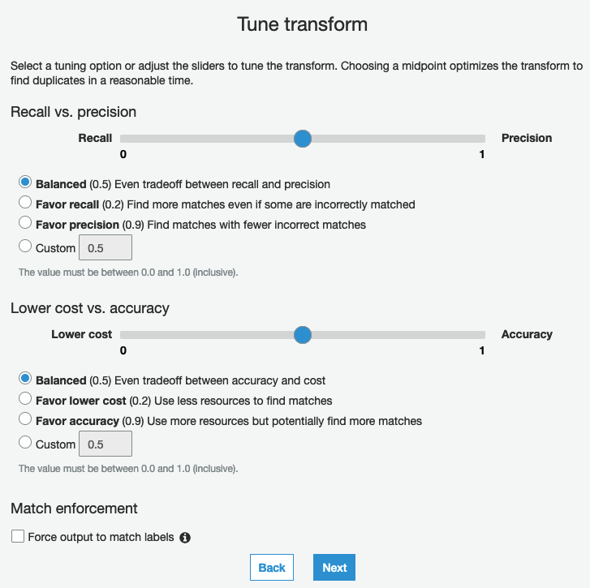

&nbsp;&nbsp;&nbsp;&nbsp;&nbsp; **5.** Review everything on the **Review** page and Click **Finish** to create the FindMatches ML Transform.

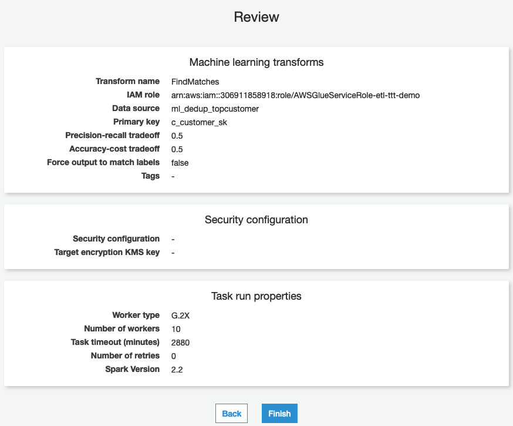

Now, it is time to teach your ML Transform. To do this, select the **FindMatches** Transform you just created, then click on the **Action** dropdown button and choose **Teach Transform**.

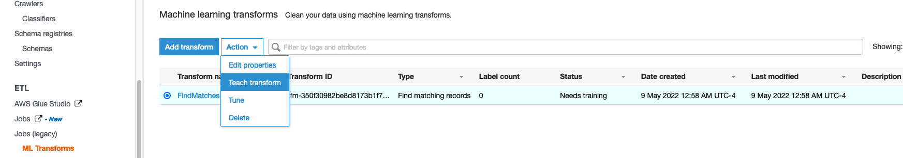

&nbsp;&nbsp;&nbsp;&nbsp;&nbsp; **1.** On **Teach the transform using labels** page, under **Labeling file** choose the option **I don't have labels**, then click on the **Generate labeling file** button. 

&nbsp;&nbsp;&nbsp;&nbsp;&nbsp; **2.** On **Generate labeling file** pop-up window, choose to S3 Path where you want to store the generated label file. Navigate to **s3://\${BUCKET\_NAME}/etl-ttt-demo/output** and, before clicking on **Generate** button, first append `/ml_gen_label_file/` to the path you navigated so far. Then click **Generate**. 

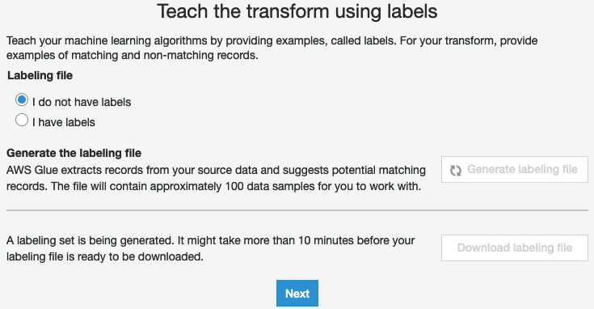

**Note:** You don't need to wait for this *generating labeling file* process to finish because you already downloaded a fully labeled file (during the first step of this lab) to be used here. **Jump to step 3** or, if you have enough time, you can wait for it to finish, then click on **Download labeling file** and perform the labeling process yourself.

&nbsp;&nbsp;&nbsp;&nbsp;&nbsp; **3.** Click **Next** and, On the **Upload labels**, under **Labeling file**, now choose **I have labels**. Then click on **Upload labeling file from S3** and navigate to the path: **s3://\${BUCKET\_NAME}/etl-ttt-demo/ml-lab/ml-labeling-file/** and select the file **top-customer-labeling-file.csv**. 

&nbsp;&nbsp;&nbsp;&nbsp;&nbsp; **4.** Choose **Overwrite my existing labels** and click **Upload**, then **Next**.

&nbsp;&nbsp;&nbsp;&nbsp;&nbsp; **5.** On **Estimate quality metrics (optional)** just click **Complete Later** to finish teaching your **FindMatches ML Transform**.

By selecting your **Transform**, you can see at the bottom, in the **Task type** column, that the **Label Uploading Process** has succeeded.

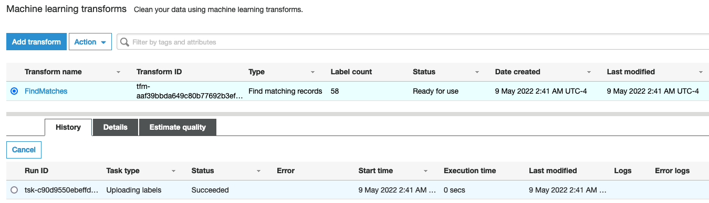

#### **2.** Testing FindMatches Transform with Glue Studio Notebook

**Note:** Before start testing, you need to download the Notebook file you will use for this section of the lab. Go to your [S3 Bucket](https://s3.console.aws.amazon.com/s3) **s3://\${BUCKET_NAME}/etl-ttt-demo/ml-lab/ml-notebook/** and download the file **ml-lab-notebook-job.ipynb** to your local computer. **You will need it next!**

Now that the **FindMatches Transform** is trained, go to the **AWS Glue Studio** once again and click on **Jobs** in the left side menu. 

On the **Jobs** page, choose the **Jupyter Notebook** option and, under **Options**, choose the option **Upload and edit an existing notebook** and click on **Choose File**. Choose the file that has been shared with you which is located . Click on **Create** afterwards.

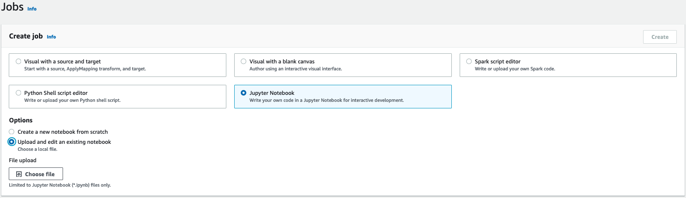

On the **Notebook setup** page, give the name to the *Job* as `ml-lab-notebook-job` and set the **IAM** to **AWSGlueServiceRole-etl-ttt-demo**. Click on **Start notebook job** button to create a **Jupyter Notebook** from an unpload notebook file. 

Once the Notebook is fully ready, run the very first **Top Cell** (Cell Zero) by clicking on the ***Play*** button (**▶**) at the top-center-left of the notebook interface: **---DO NOT click on the orange run button on the far left---**

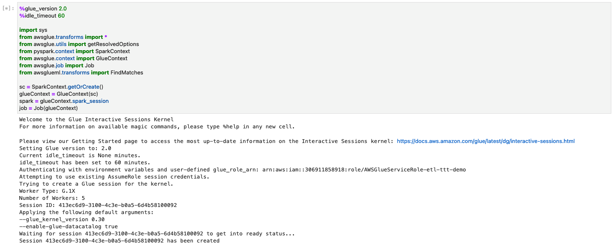

Once you see a message saying "Session XXXX-XXXX-XXXX has been created", like the picture above, run the **Cell [1]**:

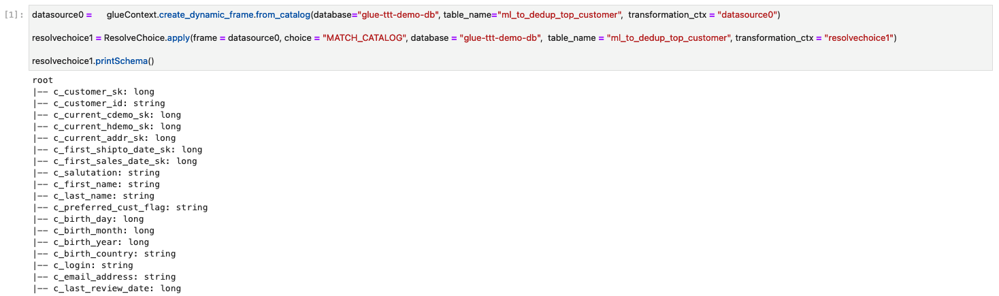

You should see the **ml\_to\_dedup\_top\_customer table's schema** in the above output.

Before you can run the **Cell [2]**, replace the **<\${YOUR\_TRANSFORM\_ID}>** placeholder for the **Transform ID** of the the **FindMatches Transform** that you created. Go back to your **Glue Console** and, under the **Details** tab copy the **Transform ID**

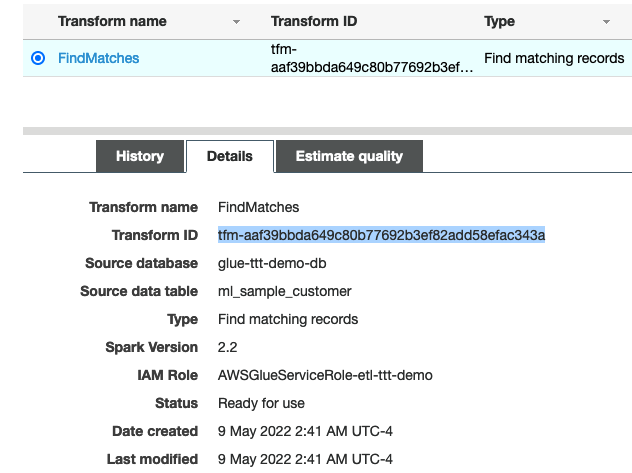

Once **Transform ID** is correctly replaced, run the **Cell [2]**. *(This Cell should take about 5-10 minutes to finish!)*

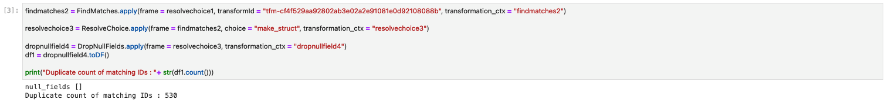

You should see the output displaying the message: *"null_fields []"*

While this is running, you can go to your **Glue Console** and see, in the **History** Tab that a new task for your **FindML Transform** will start to run thanks to the line of code you just executed.

#### **3.** Validating and Deploying the FindMatches Glue Job 

Now, to validate the **FindML Transform results**, simply run the **Cell [3]**:

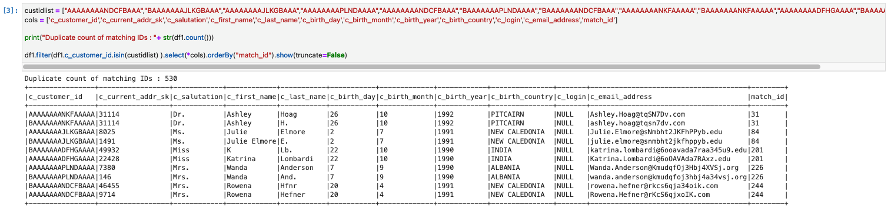

You should see the output displaying the message: *"Duplicate count of matching IDs : 530"*

Also, you should also see that the **FindMatches Transform** has added another column named **match_id** to identify matching records in the output. That means that rows with the same **match_id** are considered matching records. 

To confirm that the **FindML Transform** worked, you can actually see that from the **10 rows** returned in the output **5 are duplicates**. This proves that the **FindMatches ML Transform is working!**.

Now, let's leverage the **match_id** column created by the **FindMatches Transform** to eliminate the duplicates from the dataset. Run the **Cell 4**:

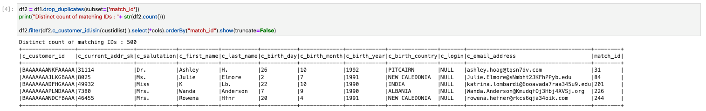

Notice the output displaying the message: *"Duplicate count of matching IDs : 500"*

That means the duplicates are now gone and that you have just **created a code that leverages the a ML Transform** that you created earlier to help you **find and eliminate duplicates** in your dataset.

You can now operationalize this code into a Glue Studio Job. But first, replace the **<\$BUCKET\_NAME>** placeholder in the last cell with the following **S3 Bucket path**:

`s3://${BUCKET_NAME}/etl-ttt-demo/output/data_analytics_team_folder/top-customers/`

**TIP:** Run the following command in your **Cloud9 Terminal** to build the full path you need:

~~~shell
echo "s3://${BUCKET_NAME}/etl-ttt-demo/output/data_analytics_team_folder/top-customers/"
~~~

You run this last cell to **sink the output data** into the **S3 Bucket**. When the code in the **Cell 5** finishes, it creates a deduplicated version of the **full top customer** dataset in S3. Check the above **S3 Bucket Path** to confirm the file is there.

**TIP:** Optionally, you can also run **S3 Select** queries on the data generated to validate as seen in the picture below:

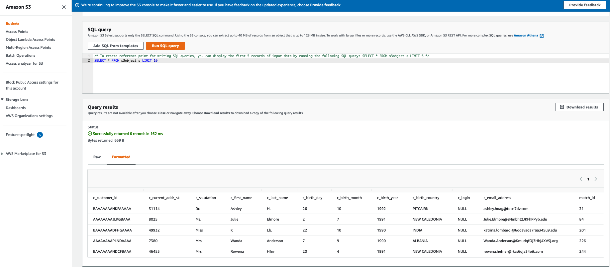

> Note 1: This **Bucket** will be used in the next lab **(Part 5)** to act as a shared data repository where the **Data Analytics team** uploads their files for further **Preparation & Analysis**.

> Note 2: In **Cell 5**, we are also adding a new column (**ib\_range\_id**) to the dataset that will be used in the final lab (*Data Quality & Data Preparation with AWS Glue DataBrew*) to suplement a join between two datasets. 

Finally, **Save** your job and download the notebook by clicking on **Download Notebook** button at the top-right of the **Glue Studio Notebook Page** in order keep a copy of the notebook locally on your computer for safety.

 
You have now concluded the **Part 5 - Machine Learning with Glue & Glue Studio Notebooks**. Once you are ready move to the **Part 6 - Workflow Orchestration with AWS Step Function**.

<!-- 

[IN CASE I DECIDE TO CHANGE TO CREATING A NEW NOTEBOOK IN THE FEATURE INSTEAD OF UPLOADING ONE]

On the **Notebook setup** page, give the name to the *Job* as `ml-lab-notebook-job` and set the **IAM** to **AWSGlueServiceRole-etl-ttt-demo**. Click on **Start notebook job** button to create a **Jupyter Notebook**. 

Once the Notebook is ready, copy the following code and replace the **first cell** with it. Click run (play **|>** icon) afterwards: **---DO NOT click on the orange run button on the far left---**

**Cell 0** [*replace the existing Cell 0*]:

~~~python
%glue_version 2.0
%idle_timeout 60

import sys
from awsglue.transforms import *
from awsglue.utils import getResolvedOptions
from pyspark.context import SparkContext
from awsglue.context import GlueContext
from awsglue.job import Job
from awsglueml.transforms import FindMatches
  
sc = SparkContext.getOrCreate()
glueContext = GlueContext(sc)
spark = glueContext.spark_session
job = Job(glueContext)
~~~

Once you see a message saying "Session XXXX-XXXX-XXXX has been created", add a new cell by clicking on the plus sign (**+**) at the top of left of the notebook interface. Copy the following code and paste it into the **Cell 2** and **run** it:

**Cell 2:**

~~~python
datasource0 =      glueContext.create_dynamic_frame.from_catalog(database="glue_ttt_demo_db", table_name="ml_to_dedup_top_customer",  transformation_ctx = "datasource0")      
                                                        
resolvechoice1 = ResolveChoice.apply(frame = datasource0, choice = "MATCH_CATALOG", database = "glue-ttt-demo-db",  table_name = "ml_dedup_full_topcustomer_csv", transformation_ctx = "resolvechoice1")

resolvechoice1.printSchema()
~~~

Once you see the **ml\_to\_dedup\_top\_customer table's schema** in the output, copy the following code and paste it into the **Cell 3**. *Don't run it as is!*
**Cell 3:**

~~~python
findmatches2 = FindMatches.apply(frame = resolvechoice1, transformId = "${YOUR_TRANSFORM_ID}", transformation_ctx = "findmatches2")

resolvechoice3 = ResolveChoice.apply(frame = findmatches2, choice = "make_struct", transformation_ctx = "resolvechoice3")

dropnullfield4 = DropNullFields.apply(frame = resolvechoice3, transformation_ctx = "dropnullfield4")
df1 = dropnullfield4.toDF()

print("Duplicate count of matching IDs : "+ str(df1.count()))
~~~

Before you run the **Cell 3**, replace the **\${YOUR\_TRANSFORM\_ID}** placeholder for the **Transform ID** of the the **FindMatches Transform** that you created.

Now you can run the **Cell 3:**. 

Cell 4:

~~~python

custidlist = ["AAAAAAAANDCFBAAA","BAAAAAAAJLKGBAAA","AAAAAAAAJLKGBAAA","AAAAAAAAPLNDAAAA","AAAAAAAANDCFBAAA","BAAAAAAAPLNDAAAA","BAAAAAAANDCFBAAA","AAAAAAAANKFAAAAA","BAAAAAAANKFAAAAA","AAAAAAAADFHGAAAA","BAAAAAAADFHGAAAA"]
cols = ['c_customer_id','c_current_addr_sk','c_salutation','c_first_name','c_last_name','c_birth_day','c_birth_month','c_birth_year','c_birth_country','c_login','c_email_address','match_id']

print("Duplicate count of matching IDs : "+ str(df1.count()))

df1.filter(df1.c_customer_id.isin(custidlist) ).select(*cols).orderBy("match_id").show(truncate=False)

~~~

Cell 5:

~~~python

df2 = df1.drop_duplicates(subset=['match_id'])
print("Distinct count of matching IDs : "+ str(df2.count()))

df2.filter(df2.c_customer_id.isin(custidlist) ).select(*cols).orderBy("match_id").show(truncate=False)

~~~

[DON'T RUN THIS CELL] Cell 6:

~~~python
new_df  = df2.select(*cols).orderBy("match_id")

new_df.coalesce(1).write.option("header","true").mode("overwrite").csv("s3://etl-ttt-demo-589541849248-us-east-2/etl-ttt-demo/output/ml-lab/topcustomers-dedup/")
~~~

[DON'T RUN THIS CELL]

<!--
S3 Target Location: s3://etl-ttt-demo-589541849248-us-east-2/etl-ttt-demo/output/ml-lab/topcustomers-dedup/ 
!-->