<h1 id="toc_0" align="center">
WORKFLOW ORCHESTRATION WITH
 AWS STEP FUNCTIONS
</h1>

In the **Part 6 - Workflow Orchestration with AwS Step Functions -** of this training you will be implement similar orchestration as the one you did during the **Part 4 - Orchestration & Data Analysis -**.

This time, as soon as a file land in the [**Amazon S3 Bucket**](https://console.aws.amazon.com/s3/) a **write event** gets recorded in the [**etl-ttt-demo-trail**](https://console.aws.amazon.com/cloudtrail/) **Cloud Trail** that you explored earlier in **Part 4**.

Note that this Trail monitors **write events** for two paths in the **etl-ttt-demo-${AWS\_ACCOUNT\_ID}-${AWS_REGION} Bucket**, as you can see in the following picture:

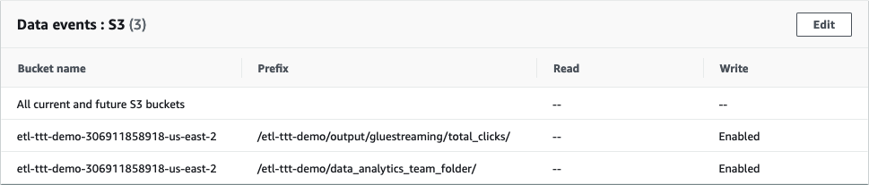

<!--
MAKE SURE THE TRAIL HAS THE FOLLOWING PATH CONFIGURED:
	- Bucket name: etl-ttt-demo-171714944327-ca-central-1  
	- Prefix:	/etl-ttt-demo/data_analytics_team_folder/
-->

For this lab, you are interested in the `/etl-ttt-demo/data_analytics_team_folder/` path which **simulates a shared repository** where the **Data Analytics team** uploads their files for further **Preparation & Analysis**. 

Furthermore, as previously explained, at every upload to this folder a **write event** gets generated. You will then create a new **EventBridge Rule** to listen to those events and automatically trigger a **Step Function's State Machine Workfow** that you will also create as part of this lab's steps. 

#### **1.** Creating the Step Function Workflow

Before creating the **Step Function Workflow**, let's first create one more **Crawler**. This cralwer is actualy **part of the Step Function Workflow** you are going to build and **it is required!**

### Final Crawler

Run the following code on your Cloud9 Enviroment Terminal to create the **ml-final-crawler**:

~~~cli
aws glue create-crawler \
	--name ml-final-crawler \
	--role AWSGlueServiceRole-etl-ttt-demo \
	--database-name glue_ttt_demo_db \
	--table-prefix ml_final_\
	--targets "{\"S3Targets\": [{\"Path\": \"s3://${BUCKET_NAME}/etl-ttt-demo/output/data_analytics_team_folder/top-customers/\"}]}"
~~~

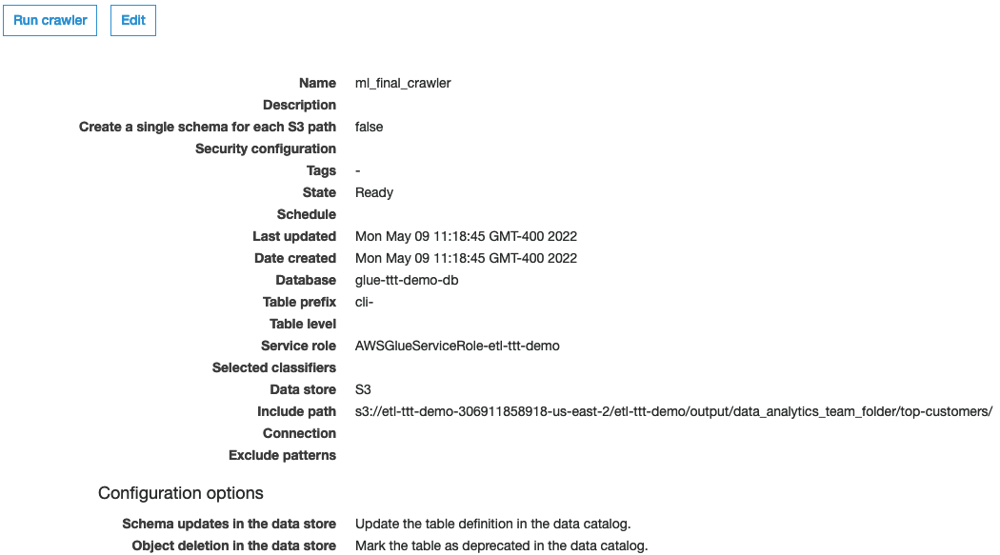

As you can see, the **ml-final-crawler** will crawl the **shared Analytics Team Folder** once the files land there.

### Step Function Workflow

Now, let's finally create the **Step Function Workflow**. 

For this, go to the [AWS Step Function](https://console.aws.amazon.com/states/) console  ***(switch to your right region if needed!)*** and click on **State machines**, under **Step Functions** label on the far left menu of the AWS Step Function Console. Then, click on **Create state machine**.

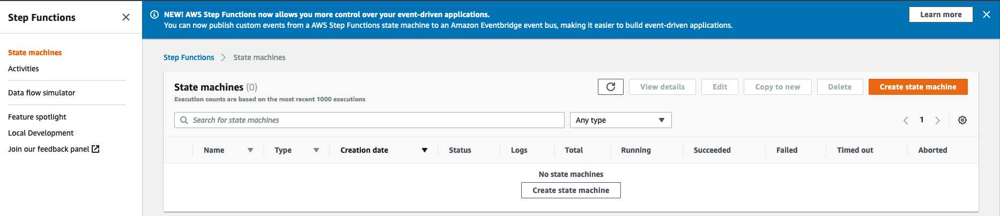

On the **Choose authoring method**, select **Write your workflow in code** and under **Type** choose **Standard**.

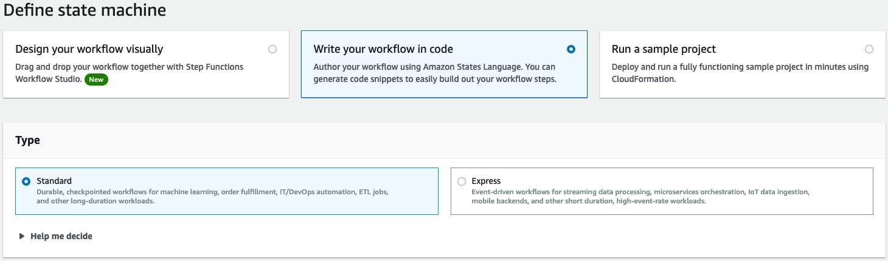
 
At the bottom of the same page, under **Definition** paste the following code:

~~~json
{
  "Comment": "A description of my state machine",
  "StartAt": "Find Match Job",
  "States": {
    "Find Match Job": {
      "Type": "Task",
      "Resource": "arn:aws:states:::glue:startJobRun.sync",
      "Parameters": {
        "JobName": "ml-lab-notebook-job"
      },
      "Comment": "To remove duplicates in the full customer dataset using FIndMatches ML Transform and output the results in another output bucket",
      "Next": "Crawl Dedup Data"
    },
    "Crawl Dedup Data": {
      "Type": "Task",
      "End": true,
      "Parameters": {
        "Name": "ml-final-crawler"
      },
      "Resource": "arn:aws:states:::aws-sdk:glue:startCrawler",
      "Comment": "To crawl the data after FindMatches dedup higiene process"
    }
  }
}
~~~

<!--

Write down the steps to create the workflow...

First is a Glue Job:

StateName: FindMatch Job 
JobName: ml-lab-notebook-job
Wait for task to complete - optional  
Next State: Add a next state
Comment: "To remove duplicates in the dataset using FIndMatches ML Transform"

Then the Glue Crawler:

StateName: Crawl Dedup Data 
JobName: ml_final_crawler
Wait for task to complete - optional  
Next State: Add a next state
Comment: "To crawl the data once the FindMatches job conclude the dedup higiene process"

-->

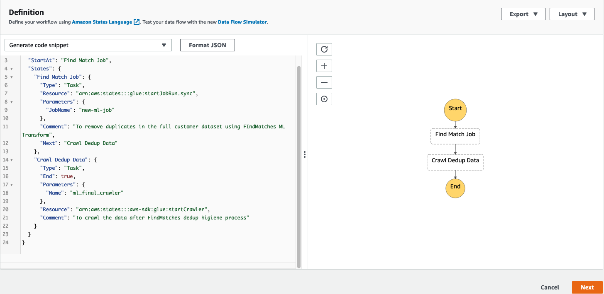

You should see the **Step Function Workflow Studio Canvans** getting updated with the graphical flow of the steps you set with the code.

Click **Next** and, on the **Specity details** page, do the following:

- Under **Name** give your **State Machine Name** the name of `findmatches-ML-dedup-workflow`.
- Under **Permissions**, select the **Choose an existing role** option and set the **IAM Role** to **AWSStepFunctionRole-etl-ttt-demo**.

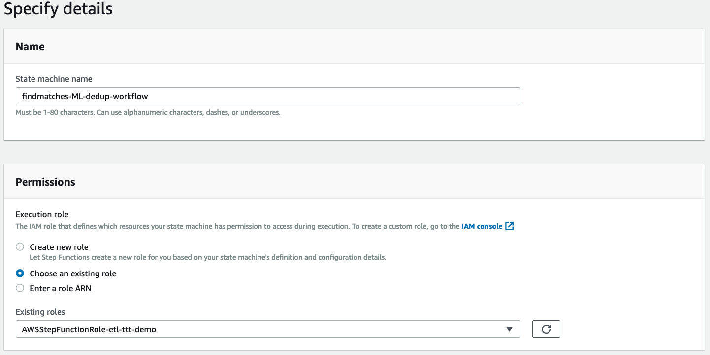

 

Scroll further down and click on the **Create state machine** button to create the **Step Function State Machine Workflow**.

 

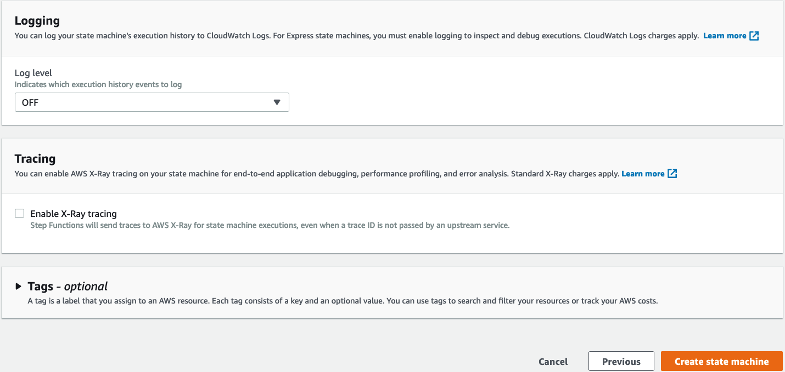

#### **2.** Creating an EventBridge Rule & Target for the Step Function Workflow (via CLI)

Now, to be able to trigger the **Step Function Workflow**, you also need to create a new **EventBridge Rule & Target**. Run the following steps in your **Cloud9 Enviroment Terminal** in sequence:

- First the **Event Rule**:

~~~cli
aws events put-rule \
    --name "find-matches-rule" \
    --event-pattern "{ \
                        \"source\": [\"aws.s3\"], \
                        \"detail-type\": [\"AWS API Call via CloudTrail\"], \
                        \"detail\": { \
                            \"eventSource\": [\"s3.amazonaws.com\"], \
                            \"eventName\": [\"PutObject\"], \
                            \"requestParameters\": { \
                                \"bucketName\": [\"${BUCKET_NAME}\"], \
                                \"key\": [{\"prefix\": \"etl-ttt-demo/data_analytics_team_folder/\"}]
                            } \
                        } \
                    }"
~~~

- Then the **Event Target**:

~~~cli
aws events put-targets \
    --rule find-matches-rule \
    --targets "Id"="findmatches-ML-dedup-workflow","Arn"="arn:aws:states:${AWS_REGION}:${AWS_ACCOUNT_ID}:stateMachine:findmatches-ML-dedup-workflow","RoleArn"="arn:aws:iam::${AWS_ACCOUNT_ID}:role/AWSEventBridgeInvokeRole-etl-ttt-demo" \
    --region ${AWS_REGION}
~~~

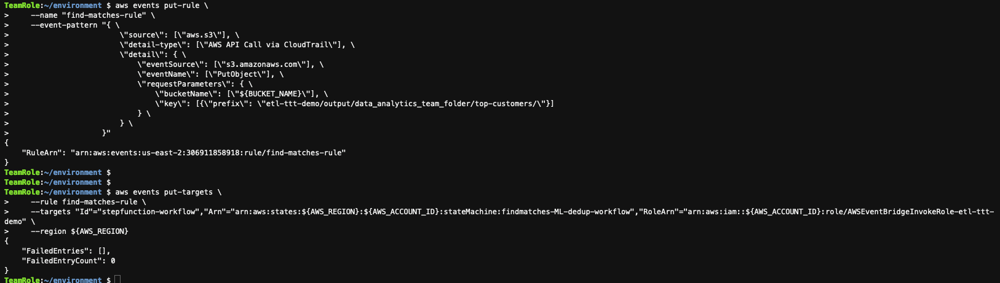

After running both commands, go to [AWS EventBridge](https://console.aws.amazon.com/events/) console. ***(switch to your right region if needed!)***.

On the left side menu, click on **Rules**, then click on top of the rule **find-matches-rule** to open its details. You should see under the **Event Pattern** tab the following:

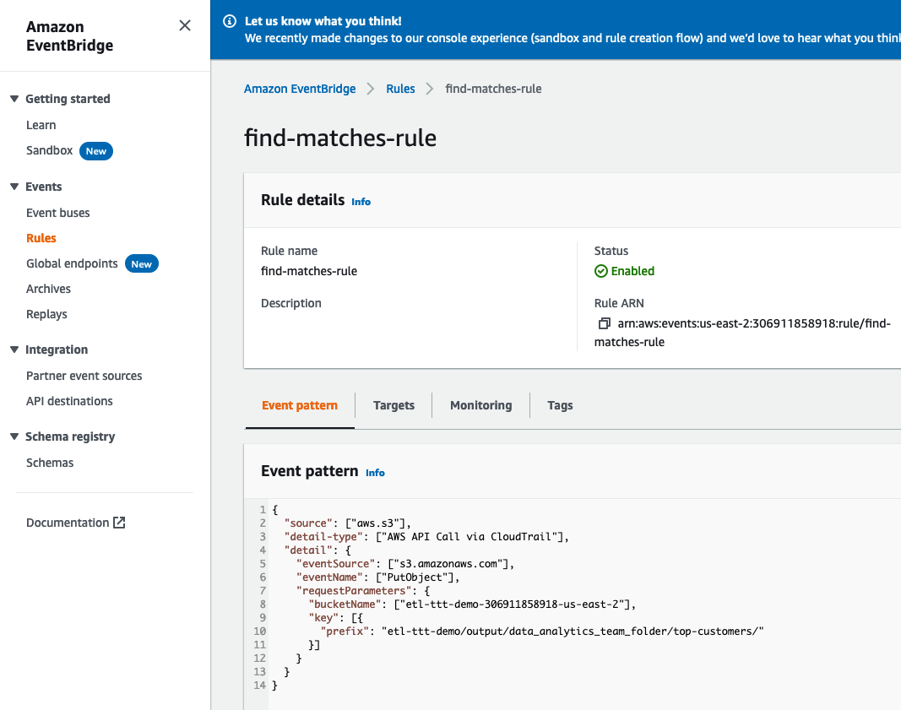

This pattern is basically saying that this **EventRule** is watching for every **PutObject** event that occur in the **bucket/prefix** specified in there.

Click on the **Targets** tab. Here, you can see that the **Target Name** points to the **Step Functions Workflow** you just created **findmatches-ML-dedup-workflow**. Also that it has a **EventBridge Role**, with all the required permissions, associated with it. This **Role** has also been created as part of the **CloudFormation template**.

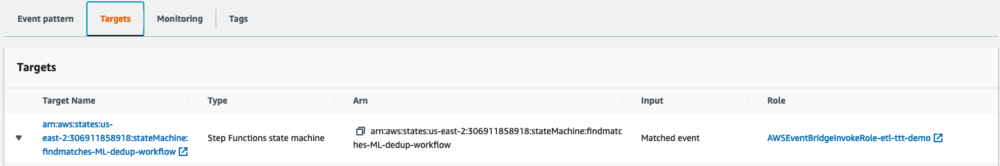

You are done creating the **resources required for this Orchestration** to work. Now, you need to simulate files being upladed into the central shared bucket repository of the Data Analytics Team, that means, the **etl-ttt-demo/output/data_analytics_team_folder/top-customers/**.

To do that, go back to your **Cloud9 Enviroment Terminal** and run the following **S3 command to upload a file that contains duplicated** data into the **Data Analytics Team's shared folder**:

~~~cli
aws s3 cp /tmp/dsd/csv_tables/ml-lab/ml-customer-full/full-top-customer.csv s3://$BUCKET_NAME/etl-ttt-demo/data_analytics_team_folder/
~~~

Once the above file is uploaded, it will then trigger the **Step Function Workflow** that you created which, consequently, will run the **ml-lab-notebook-job** that contains the **FindMatches Transform** and all the necessary code you wrote to transform the **source duplicated data** into a **deduplicated version** of the **full top customers** dataset that the fictitious **Data Analytics Team** will use in order to proceed with their **Data Preparation work**.

###Following the flow

You can follow the flow by going first to the [Step Function Workflow](https://console.aws.amazon.com/states/) page and looking your **findmatches-ML-dedup-workflow** workflow. There, under **Executions**, you can click on the one that **Status** column says **Running** and click on **View Details**. You should see the graphical workflow changing its states.

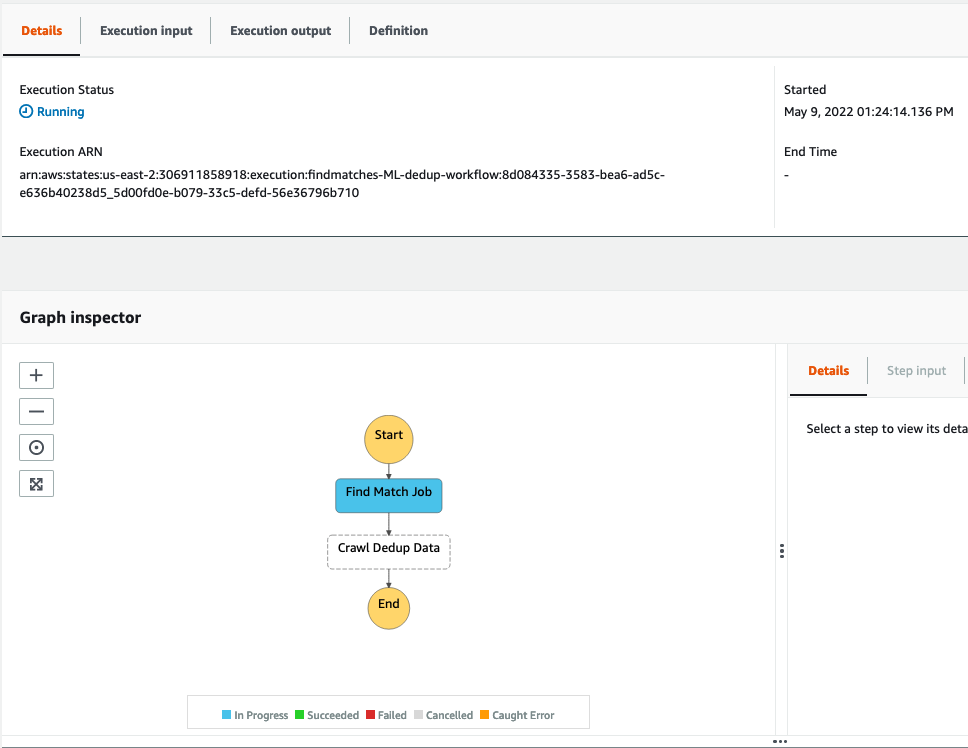

From there, go to your [Glue Studio Console](https://console.aws.amazon.com/gluestudio/) ***(switch to your right region if needed!)*** and look for your job **ml-lab-notebook-job** under the **Monitoring** page. Then, click on the big blue number under **Running** to scroll to the running Jobs, and confirm that your job is running.

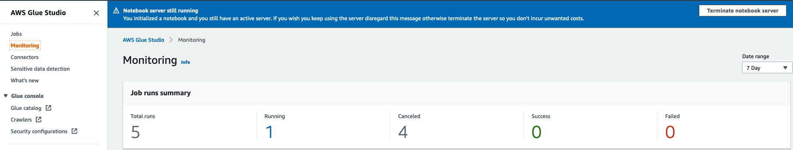

Finally, go to the [Glue Console](https://console.aws.amazon.com/glue/) ***(switch to your right region if needed!)*** and look for two things:

- The **FindMatches ML Transform**: This should take about 6-7 minutes to complete:

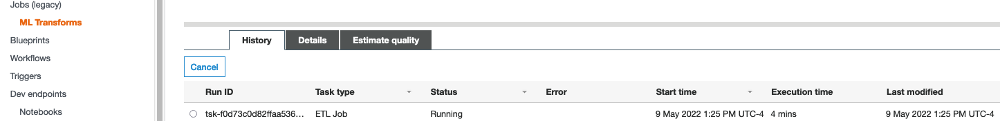

- The **ml_final_crawler**: This will start as soon as your **ml-lab-notebook-job** succeed and it will create **1 new table**:

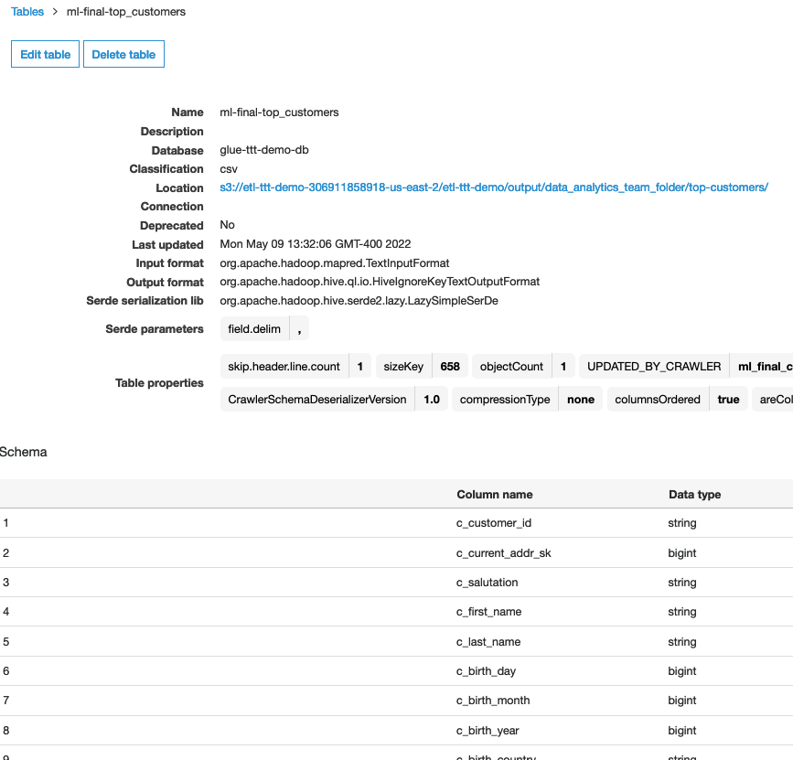

 

Once the Crawler finishes, it will create the new table based on the **deduplicated version** of the **full top customers** dataset. This **deuplicated version** will then be served as the **source dataset** for the fictitious **Data Analytics Team** to work with it the AWS Glue Databrew.

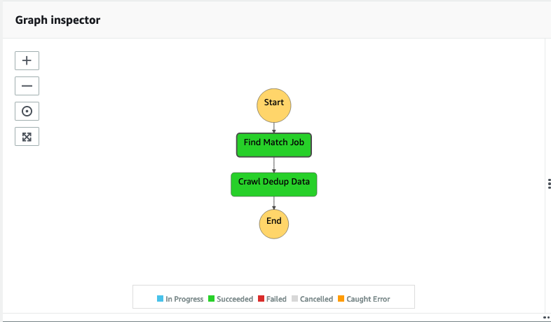

Once you are ready move to the **Part 7 - Data Quality & Data Preparation with AWS Glue DataBrew**.