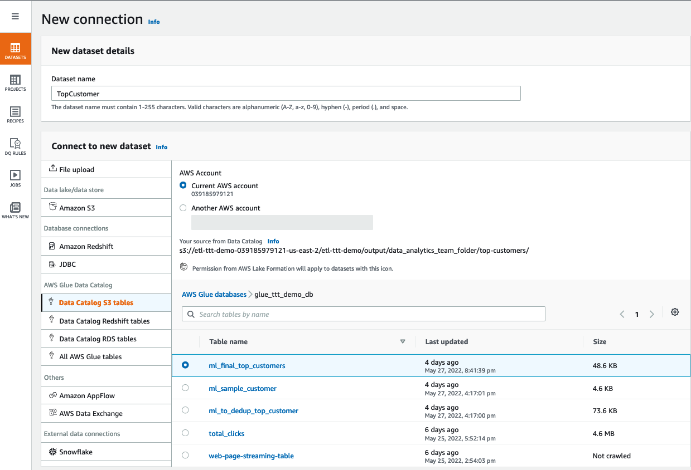
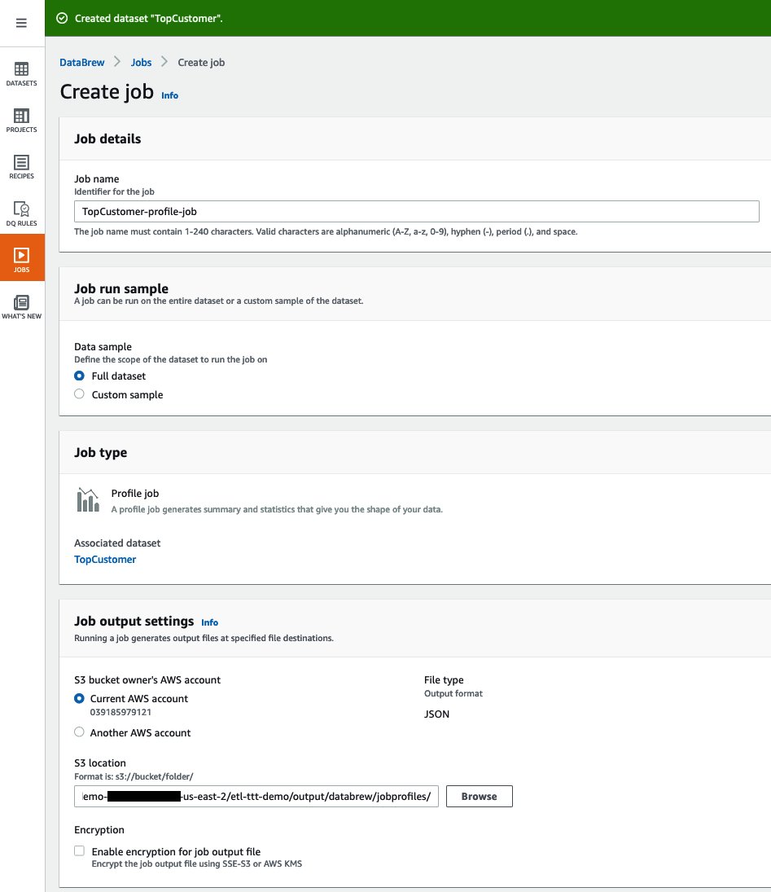
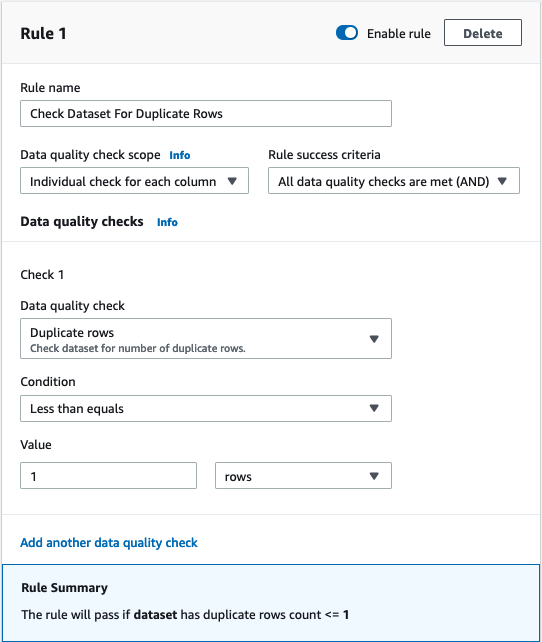
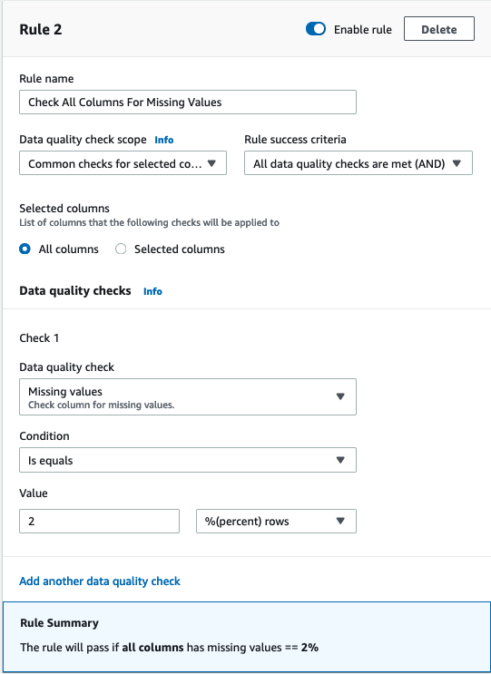
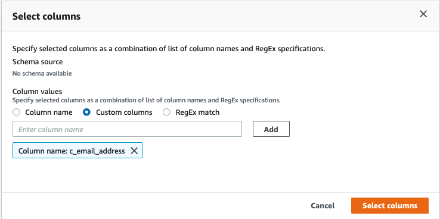
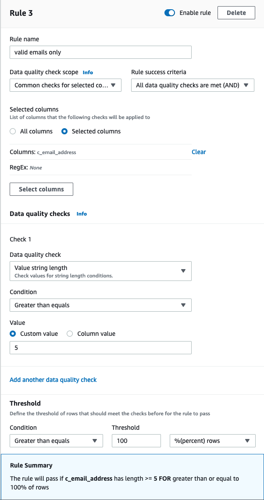
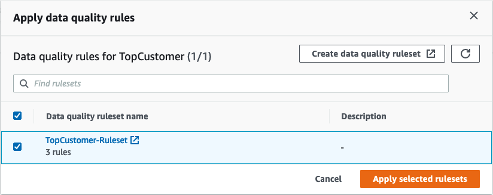
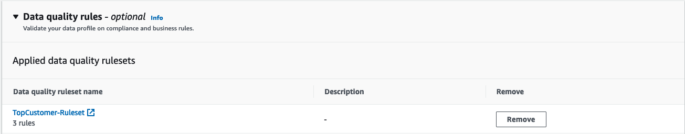

<h1 id="toc_0" align="center">
CREATING AND PROFILING THE FIRST DATASET
</h1>

#### **1.** Creating the first Dataset 

------ CHANGE THAT --------

We will first create a DataBrew Dataset using a Glue crawler to explore the COVID-19 data stored in a Data Catalog table. In DataBrew, Dataset simply means a set of data—rows or records that are divided into columns or fields. When you create a DataBrew project, you connect to or upload data that you want to transform or prepare. DataBrew can work with data from any source, imported from formatted files, and it connects directly to a growing list of data stores. In DataBrew, a Dataset is a read-only connection to your data. DataBrew collects a set of descriptive metadata to refer to the data. No actual data can be altered or stored by DataBrew. For simplicity, we use the word dataset to refer to both the actual dataset and the metadata that DataBrew uses.

----

To start the lab, first go to the [AWS Glue DataBrew](https://console.aws.amazon.com/databrew/) console. ***(switch to the right region if needed!)***

Follow the steps below to create a new DataBrew dataset

&nbsp;&nbsp;&nbsp;&nbsp;&nbsp; **1.** Click the **DATASETS** icon on the left.

&nbsp;&nbsp;&nbsp;&nbsp;&nbsp; **2.** Click the **Connect new dataset** button in the middle.

&nbsp;&nbsp;&nbsp;&nbsp;&nbsp; **3.** Under New dataset details set Dataset name to `TopCustomer`.

&nbsp;&nbsp;&nbsp;&nbsp;&nbsp; **4.** Under **Connect to new dataset** click **Data Catalog S3 tables** under **AWS Glue Data Catalog** section. 

&nbsp;&nbsp;&nbsp;&nbsp;&nbsp; **5.** In the **AWS Glue databases** list, click  on **glue\_ttt\_demo\_db**, then on click the radio button next to table **ml\_final\_top\_customers**.

&nbsp;&nbsp;&nbsp;&nbsp;&nbsp; **6.** Click on the **Create dataset** button.

#### **2.** Profiling the first Dataset leveraging Quality Rules.

Once the new dataset is created, we will run the profiling job on the new dataset. When you profile your data, DataBrew creates a report called a data profile. This summary tells you about the existing shape of your data, including the context of the content, the structure of the data, and its relationships. You can make a data profile for any dataset by running a data profile job.

&nbsp;&nbsp;&nbsp;&nbsp;&nbsp; **1.** Click the checkbox next to the **TopCustomer** dataset.

&nbsp;&nbsp;&nbsp;&nbsp;&nbsp; **2.** Click ▶ **Run data profile** on the top. On the pop-up window click **Create profile job** to open **Create job** page.

&nbsp;&nbsp;&nbsp;&nbsp;&nbsp; **3.** Under Job details, set Job name to `TopCustomer-profile-job`.

&nbsp;&nbsp;&nbsp;&nbsp;&nbsp; **4.** Under Job run sample select **Full dataset**.

&nbsp;&nbsp;&nbsp;&nbsp;&nbsp; **5.** Under **Job output settings** click on the **Browse** button to set the **S3 location** to **s3://\$BUCKET_NAME/etl-ttt-demo/output/** (navigate up to the **output** folder then paste the rest of the path manually: `databrew/jobprofiles/`).

&nbsp;&nbsp;&nbsp;&nbsp;&nbsp; **6.** Skip the next **Dataset profile configurations -** ***optional*** and scroll down to **Data quality rules**. Click on the **Apply data quality ruleset** button.

&nbsp;&nbsp;&nbsp;&nbsp;&nbsp; **7.** On the pop-up window, click on the button **Create data quality ruleset**. (This will take you to a different tab in your browser. ***Do not close the previous tab!***)

&nbsp;&nbsp;&nbsp;&nbsp;&nbsp; **8.** On this new tab, name the **Ruleset** as `TopCustomer-Ruleset` and verify that **Associated dataset** shows **TopCustomer** there.

&nbsp;&nbsp;&nbsp;&nbsp;&nbsp; **9.** Click on the **Recommendations(2)** tab on the right side of the screen then mark the **Select all** checkbox. Click **Add to ruleset**. (Two rules will be automatically added to the Ruleset on the left side of the screen, **Rule 1** and **Rule 2**).

&nbsp;&nbsp;&nbsp;&nbsp;&nbsp; **10.** Edit **Rule 1** as follow:

&nbsp;&nbsp;&nbsp;&nbsp;&nbsp; **11.** Edit **Rule 2** as follow:

&nbsp;&nbsp;&nbsp;&nbsp;&nbsp; **12.** Click on the **Add another rule** button at the bottom of the left side to add another custom rule. The **Rule 3** will appear:

 Note: In **Rule 3**, under **Selected Columns**, choose **Selected columns** and click on the **Select columns** button, then select **Custom columns**, type `c_email_address` in the field and click **Add**. Then click the oragne **Select columns** button. See the following picture:

&nbsp;&nbsp;&nbsp;&nbsp;&nbsp; **13.** Edit **Rule 3** as follow:

&nbsp;&nbsp;&nbsp;&nbsp;&nbsp; **13.** Confirm that all the **3 Rule Summaries** (Blue banner) says the following:

- **Rule 1:** The rule will pass if dataset has **duplicate rows count <= 1** 
- **Rule 2:** The rule will pass if all columns has **missing values == 2%**
- **Rule 3:** The rule will pass if **c_email_address has length >= 5** FOR greater than or equal to 100% of rows 

&nbsp;&nbsp;&nbsp;&nbsp;&nbsp; **14.** Click on **Create ruleset** button at the bottom of the page. You can close this tab now and you should get back to previous one where the **Apply data quality rules** pop-up window is still open.

&nbsp;&nbsp;&nbsp;&nbsp;&nbsp; **15.** Still on this pop-up window, click on the **refresh button**, choose the ruleset **TopCustomer-Ruleset** you just created and click on **Apply selected rulesets**.

You should see this now:

&nbsp;&nbsp;&nbsp;&nbsp;&nbsp; **16.**  Scroll to **Permission**, select **AWSGlueDataBrewServiceRole-etl-ttt-demo** for **Role name**. Then, click **Create and run job**.

The profile job takes about 5 minutes. Let's now create another dataset in the meantime!

