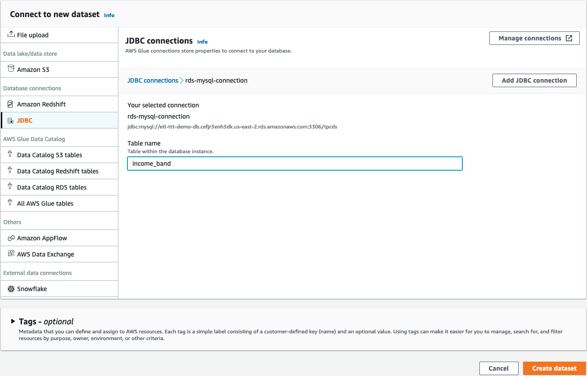
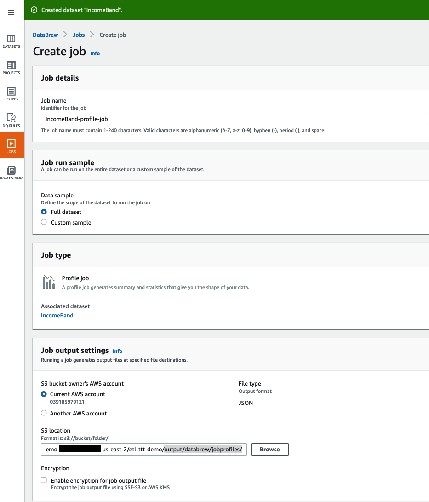
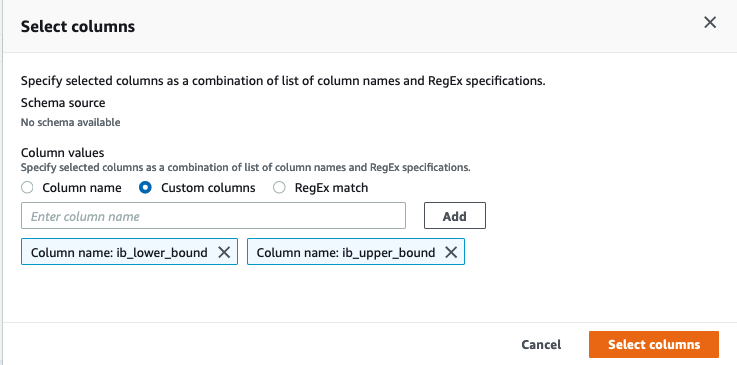
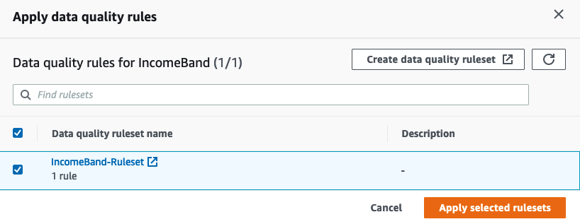
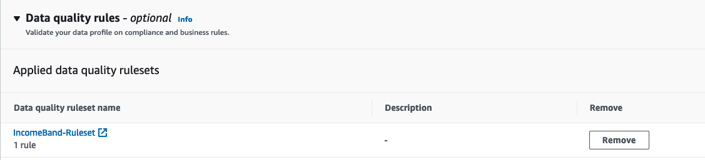

<h1 id="toc_0" align="center">
CREATING AND PROFILING THE SECOND DATASET
</h1>

#### **3.** Creating an RDS-based datasets & Profiling the Data (with Quality Rules).

Follow the steps below to create another DataBrew dataset

&nbsp;&nbsp;&nbsp;&nbsp;&nbsp; **1.** Click the **DATASETS** icon on the left.

&nbsp;&nbsp;&nbsp;&nbsp;&nbsp; **2.** Click the **Connect new dataset** button in the middle.

&nbsp;&nbsp;&nbsp;&nbsp;&nbsp; **3.** Under New dataset details set Dataset name to `IncomeBand`.

&nbsp;&nbsp;&nbsp;&nbsp;&nbsp; **4.** Under **Connect to new dataset** click **JDBC** this time which is under the **Database Connections** section. 

&nbsp;&nbsp;&nbsp;&nbsp;&nbsp; **5.** In the **JDBC connections** list, click  on **rds-mysql-connection**, then type `income_band` in the **Table name** textfield.

&nbsp;&nbsp;&nbsp;&nbsp;&nbsp; **6.** Click on the **Create dataset** button.

#### **4.** Profiling the second Dataset leveraging Quality Rules.
	

[PROFILE INCOME_BAND DATASET WITH 1 QUALITY RULE]
  
Full dataset  

Ruleset: Income-Band-Ruleset
Rule Name: Income Check for Negative Values  
Rule Summary: The rule will pass if **ib\_lower\_bound**, **ib\_upper\_bound** has values >= 0 FOR greater than or equal to 100% of rows

Once the second dataset is created, we will run the profiling job on the new dataset.

&nbsp;&nbsp;&nbsp;&nbsp;&nbsp; **1.** Click the checkbox next to the **IncomeBand** dataset.

&nbsp;&nbsp;&nbsp;&nbsp;&nbsp; **2.** Click ▶ **Run data profile** on the top. On the pop-up window click **Create profile job** to open **Create job** page.

&nbsp;&nbsp;&nbsp;&nbsp;&nbsp; **3.** Under Job details, set Job name to `IncomeBand-profile-job`.

&nbsp;&nbsp;&nbsp;&nbsp;&nbsp; **4.** Under Job run sample select **Full dataset**.

&nbsp;&nbsp;&nbsp;&nbsp;&nbsp; **5.** Under **Job output settings** click on the **Browse** button to set the **S3 location** to **s3://\$BUCKET_NAME/etl-ttt-demo/output/databrew/jobprofiles/** (You should have the full path now!).

&nbsp;&nbsp;&nbsp;&nbsp;&nbsp; **6.** Skip the next **Dataset profile configurations -** ***optional*** and scroll down to **Data quality rules**. Click on the **Apply data quality ruleset** button.

&nbsp;&nbsp;&nbsp;&nbsp;&nbsp; **7.** On the pop-up window, click on the button **Create data quality ruleset**. (This will take you to a different tab in your browser. ***Do not close the previous tab!***)

&nbsp;&nbsp;&nbsp;&nbsp;&nbsp; **8.** On this new tab, name the **Ruleset** as `IncomeBand-Ruleset` and verify that **Associated dataset** shows **IncomeBand** there.

&nbsp;&nbsp;&nbsp;&nbsp;&nbsp; **9.** This time, **DO NOT** click on the **Recommendations(2)** tab on the right side of the screen. Just edit the existing **Rule 1** already there.

 Note: For this **Rule 1**, under **Selected Columns**, choose **Selected columns** and click on the **Select columns** button, then select **Custom columns**, type `ib_lower_bound` in the field and click **Add**, then type `ib_upper_bound` and click **Add** again. Then, click the oragne **Select columns** button. See the following picture:

&nbsp;&nbsp;&nbsp;&nbsp;&nbsp; **13.** Confirm that all the **Rule Summaries** (Blue banner) says: "*The rule will pass if* ***ib\_lower\_bound***, ***ib\_upper\_bound*** *has values >= 0 FOR greater than or equal to 100% of rows*

&nbsp;&nbsp;&nbsp;&nbsp;&nbsp; **14.** Click on **Create ruleset** button at the bottom of the page. You can close this tab now and you should get back to previous one where the **Apply data quality rules** pop-up window is still open.

&nbsp;&nbsp;&nbsp;&nbsp;&nbsp; **15.** Still on this pop-up window, click on the **refresh button**, choose the ruleset **IncomeBand-Ruleset** you just created and click on **Apply selected rulesets**.

You should see this now:

&nbsp;&nbsp;&nbsp;&nbsp;&nbsp; **16.**  Scroll to **Permission**, select **AWSGlueDataBrewServiceRole-etl-ttt-demo** for **Role name**. Then, click **Create and run job**.

The profile job takes about 5 minutes. You don't need to wait for it to finish. Let's now start the project!