<h1 id="toc_0" align="center">
WORKING WITH DATABREW RECIPES AND PROJECTS
</h1>

#### **5.** Creating a DataBrew Project

While the previous dataset profile is running, do the following:

&nbsp;&nbsp;&nbsp;&nbsp;&nbsp; **1.** Click the **PROJECTS** icon on the left.

&nbsp;&nbsp;&nbsp;&nbsp;&nbsp; **2.** Click the **Create project** button in the middle.

&nbsp;&nbsp;&nbsp;&nbsp;&nbsp; **3.** Under **Project details** set **Project name** to `TopCustomers-PerBand`.

&nbsp;&nbsp;&nbsp;&nbsp;&nbsp; **4.** Scroll down to **Select a dataset**, make sure the option **My datasets** is selected and then choose the **IncomeBand** dataset.

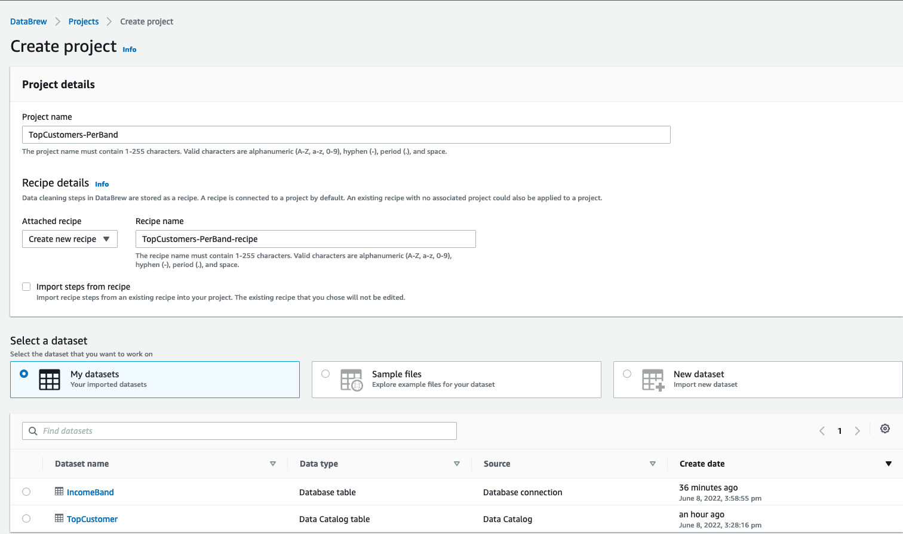

&nbsp;&nbsp;&nbsp;&nbsp;&nbsp; **5.** Scroll to **Permission**, select **AWSGlueDataBrewServiceRole-etl-ttt-demo** for **Role name**. Then, click on the **Create project** button at the bottom of the page. 

> Once a project session is initiated, it may take couple of minutes for the session to become fully ready and operational. Wait for the following screen to complete loading:

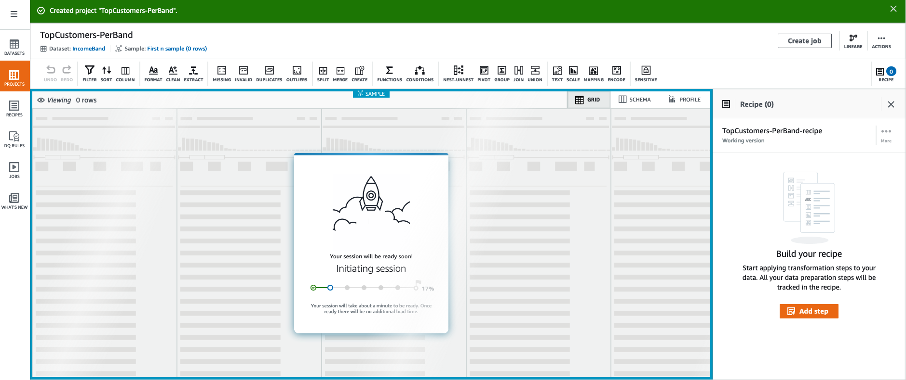

Once the project is fully ready, you will be presented with an spreedsheet-like view with multiple shortcut buttons at the top. The data you see there are the first 20 rows (default) of the **IncomeBand** dataset. Take your time to explore the shortcuts and the interface of DataBrew's project view.

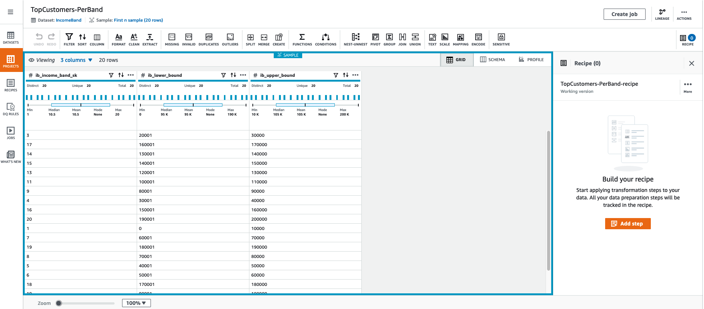

#### **6.** Adding steps to a project

To start building a recipe, you first need to add steps to it. Let's manually add a first step to our project:

&nbsp;&nbsp;&nbsp;&nbsp;&nbsp; **1.** On the top list of shortcuts, choose **JOIN**.

&nbsp;&nbsp;&nbsp;&nbsp;&nbsp; **1.** In the next screen, under **Select dataset**, select **TopCustomer** from the dropdown list and click **Next**

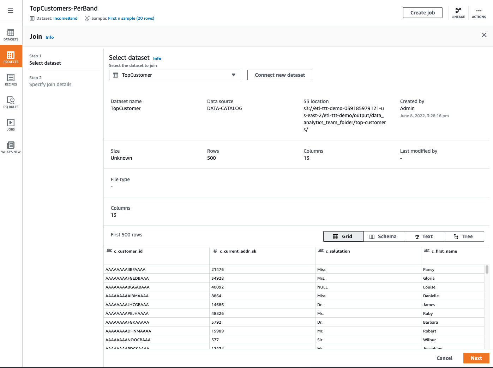

&nbsp;&nbsp;&nbsp;&nbsp;&nbsp; **1.** In the next screen, choose a **Right Join** under **Select join type**. Then do the following:

- Under **Table A** (IncomeBand), choose **ib\_income\_band\_sk**
- Under **Table B** (TopCustomer), choose **ib\_range\_id**
- Under **Column List**, uncheck the column **ib\_income\_band\_sk** of source table **Table A**

Your screen should look like this:

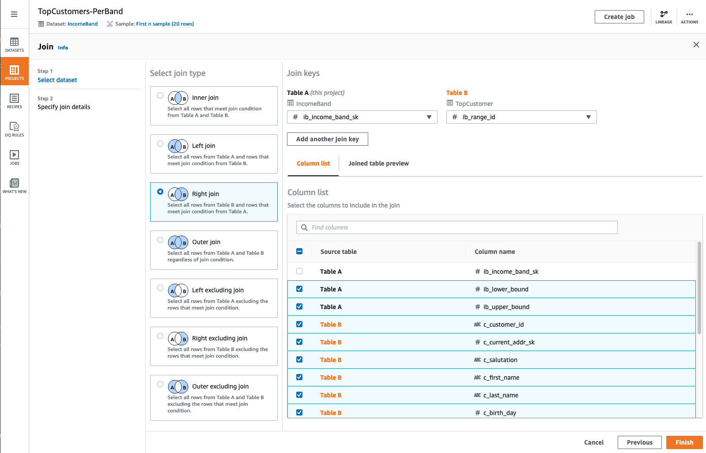
 
 

After adding this first **JOIN step** you can now see the results of a **Right Join** between **IncomeBand** dataset and **TopCustomer** dataset in which the columns **ib\_income\_band\_sk** and **ib\_range\_id** were used as the **JOINing** columns.

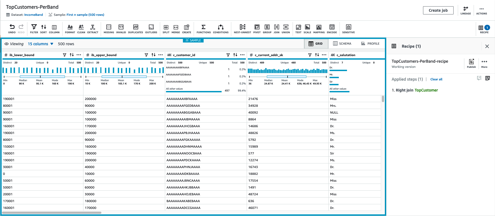

> If you recall, the **ib\_range\_id** column was added as part of the **Machine Learning** lab. Essentially, the idea was to randomly assign to every customer an **Income Band ID** (ib\_range\_id) which would fall under a specific upper/lower bound range.

#### **6.** Sharing, Managing & Building up Recipes

Now that you have manually added a step that joins both datasets, let's leverage an **already-made Recipe** to automatically add the rest of the steps. Run the following code to download the **Recipe**.

~~~shell
mkdir -p /tmp/dsd/databrew-recipe/
aws s3 cp s3://ee-assets-prod-${AWS_REGION}/modules/31e125cc66e9400c9244049b3b243c38/v1/downloads/etl-ttt-workshop/databrew/TopCustomers-PerBand-recipe.json  /tmp/dsd/databrew-recipe/TopCustomers-PerBand-recipe.json

aws s3 cp --recursive /tmp/dsd/databrew-recipe/ s3://$BUCKET_NAME/etl-ttt-demo/databrew-recipe/ 
~~~

Go to your [S3 Bucket](https://s3.console.aws.amazon.com/s3) and navigate to: **s3://\$BUCKET_NAME/etl-ttt-demo/databrew-recipe/**. Download the file named: **TopCustomers-PerBand-recipe.json**. *(Keep this file in a known location in your computer.)*

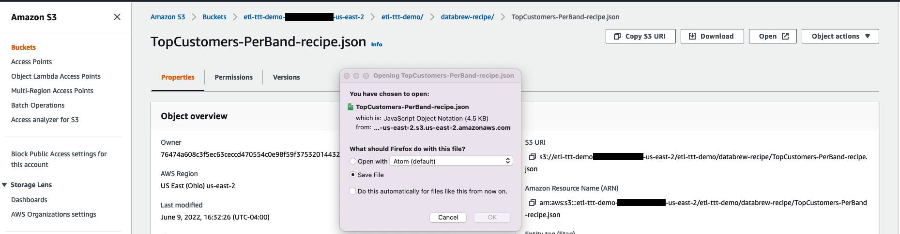

> The idea is to simulate the situation where someone else in your team has already worked on the necessary steps to prepare this particular data and it is now sharing this with you. By sharing recipes you are encouraging work reusability and speeding up team's productivity.
 
Now, do the following to **Upload a Recipe** to your **Glue DataBrew's Recipe** enviroment:

&nbsp;&nbsp;&nbsp;&nbsp;&nbsp; **1.** Click the **RECIPES** icon on the left.

&nbsp;&nbsp;&nbsp;&nbsp;&nbsp; **2.** Click on the **Upload recipe** button in the far right.

&nbsp;&nbsp;&nbsp;&nbsp;&nbsp; **3.** Enter a **Recipe name** such as: `team-shared-recipe`. Then add a description too: `Recipe shared from my org's data analyst team - Note: Not the final version!`.

&nbsp;&nbsp;&nbsp;&nbsp;&nbsp; **4.** Click on the **Choose File** button, navigate to where you downloaded the recipe file **TopCustomers-PerBand-recipe.json** in your computer and upload it.

&nbsp;&nbsp;&nbsp;&nbsp;&nbsp; **5.** Click on the **Create and publish recipe** button at the bottom to complete the **Recipe's uploading and publishing** process.

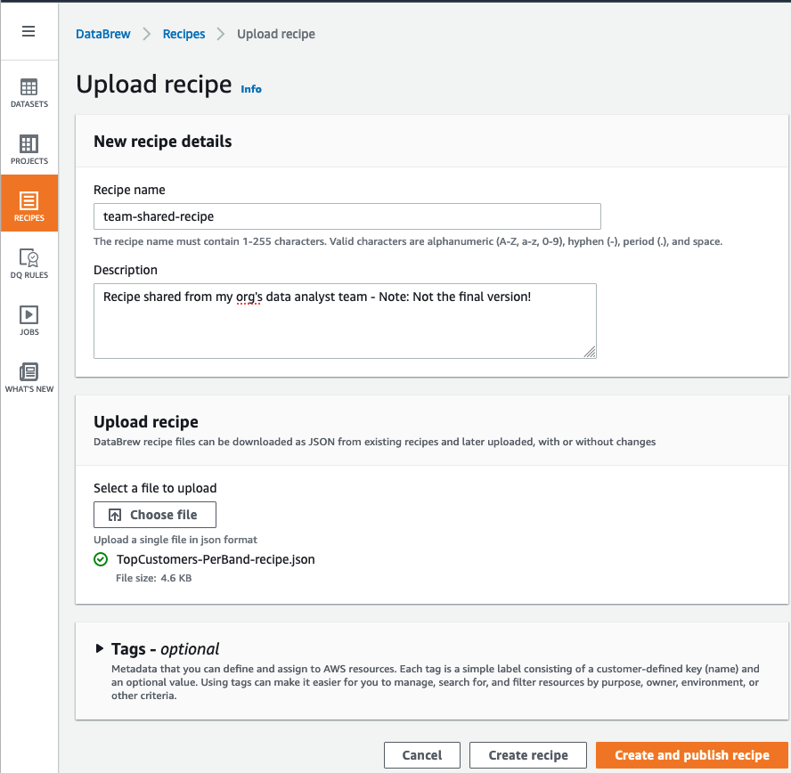

Once the recipe has been uploaded and publish you can now leverage it into your project. To do so:

&nbsp;&nbsp;&nbsp;&nbsp;&nbsp; **6.** Click back on the **PROJECTS** icon on the left and reonpen your project **TopCustomers-PerBand**.

&nbsp;&nbsp;&nbsp;&nbsp;&nbsp; **7.** On the far right of your screen, look for a **3-dot icon (...)** labeled **More**, then click on **Import recipe**.

> *(If you can't find it, click on the icon* **RECIPE** *in the far top right of the page to expand the recipe panel)*
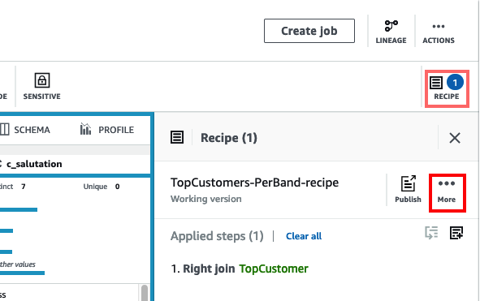

&nbsp;&nbsp;&nbsp;&nbsp;&nbsp; **8.** On the pop-up screen, check the **team-shared-receipt** and click **Next**.

&nbsp;&nbsp;&nbsp;&nbsp;&nbsp; **9.** On the next page, keep **Append** selected and click **Next** again to start validating each step within this recipe.

There will be **22 steps** to be validated. Just allow for the validation process to complete and you should see all the **22 steps greening out** like the following picture:

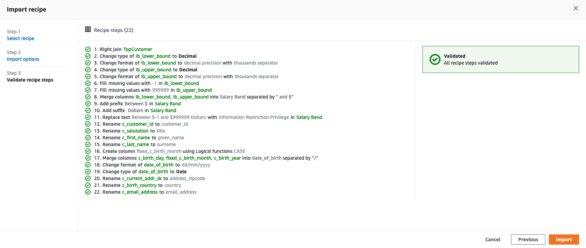

&nbsp;&nbsp;&nbsp;&nbsp;&nbsp; **10.** Click on the **Import** button to finish the import and append all the recipe's steps to your current project's recipe.

After importing all the steps, you should notice that the data representation will change accordingly and you will see the following changes:

- The columns **ib\_lower\_bound** and **ib\_upper\_bound** has been changed to Decimal (with a thousand separator) and they turned into a combined single column named **Salary Band**
- Some columns were renamed (mostly, the **c\_** portion of them was removed despite other changes in their names)
- A new column (with a **date format/type**) named **date\_of\_birth** has been created (by merging **c\_birth\_month**, **c\_birth\_day** and **c\_birth\_year**)

To complete the data preparation, let's do few more things to this recipe:

&nbsp;&nbsp;&nbsp;&nbsp;&nbsp; **11.** First, lets reorder some steps. To do that click on the tiny icon that says **Reorder Steps** when you hover the mouse over it (*near to where it says* ***Applied steps(22) | Clear all*** )

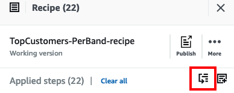

&nbsp;&nbsp;&nbsp;&nbsp;&nbsp; **12.** A pop-up windown will appear. There, click and hold the **tiny 6 dot icon** in front of the number 20 (Step 20) and move it up to after the step 15. Repeat this process for steps 21 and 22. Once done, your scree should look like the following:

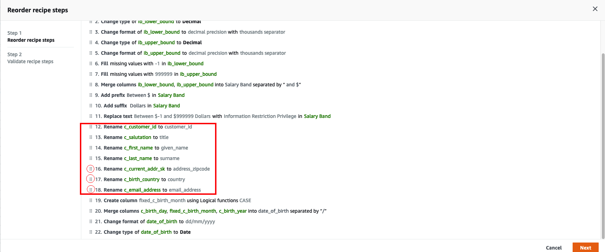

&nbsp;&nbsp;&nbsp;&nbsp;&nbsp; **13.** Click **Next** to re-validate the steps then **Done** to apply this reorder operation to the recipe.

Now, let's create an Age column using a function called **DATEDIFF**. This function calculates the **difference between two dates** and return a value that can be expressed in **Days, Months, Years**, etc. In this case, let's express it as **Year** in order to have the actual age of a person in a column.

&nbsp;&nbsp;&nbsp;&nbsp;&nbsp; **15.** Click on the tiny icon that says **Add Step** when you hover the mouse over it (*near to* ***Reorder Steps*** *you justed clicked in step 11*). In the search box that appear that says **"Find Steps"** type: `DATEDIFF` and select it from the dropdown list.

&nbsp;&nbsp;&nbsp;&nbsp;&nbsp; **13.** You must now define the entries for this function. Do the following:

- For Value 1 you should select the option **Select source column** and choose the column **date\_of\_birth**
- For Value 2 you should keep **Enter custome value** and select today's date in the calendar.
- Choose **Unit** as **Years**
- Type `Age` in the **Destination Column** field

See the picture below for reference:

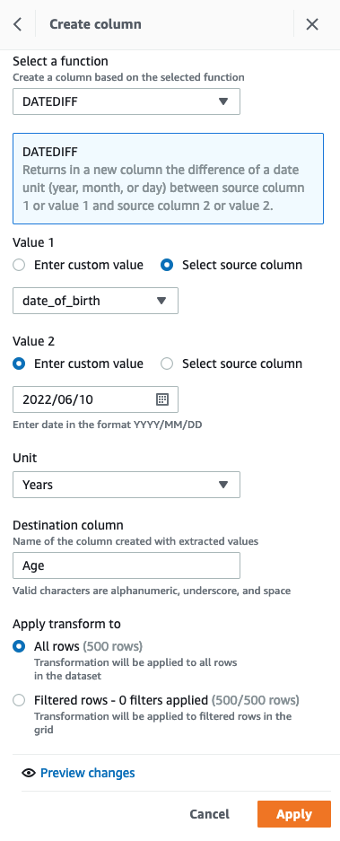

&nbsp;&nbsp;&nbsp;&nbsp;&nbsp; **13.** Click **Apply** to apply the changes.

&nbsp;&nbsp;&nbsp;&nbsp;&nbsp; **13.** Now, you can drop the unecessary columns. On the shortcut bar, click on the fifth icon that says **COLUMN** then choose **Delete**.

&nbsp;&nbsp;&nbsp;&nbsp;&nbsp; **13.** A new step window will appear to the left. On the **Source columns** drop down choose:

-  **date\_of\_birth**
-  **c\_birth_\_month**
-  **c\_login**
-  **match\_id**
-  **ib\_range\_id**

&nbsp;&nbsp;&nbsp;&nbsp;&nbsp; **13.** Click **Apply** for the last time.

&nbsp;&nbsp;&nbsp;&nbsp;&nbsp; **13.** Finally, click on the icon **Publish** (above the **Add Steps** and **Reoder Steps** icons. Write a meaningful description to your recipe such as `This is the final recipe!` and click **Publish**.

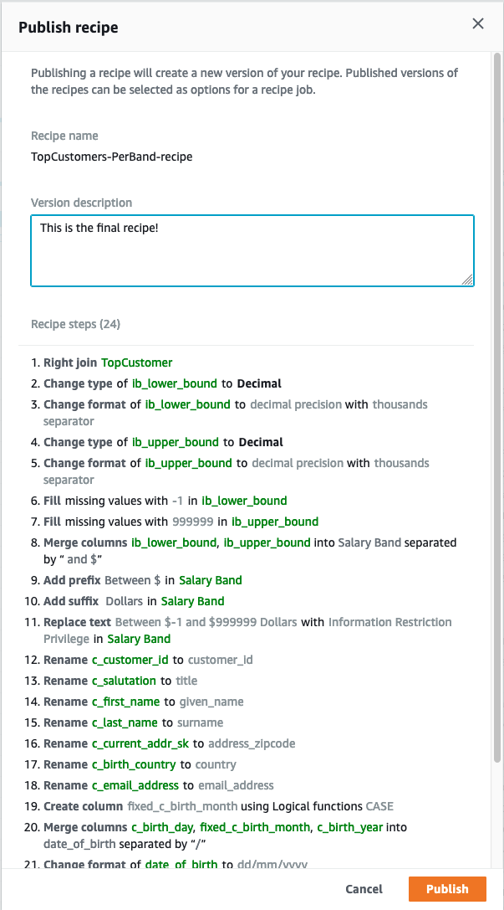

You have now fully prepared your dataset and created a new recipe with combines steps that have been shared with you and steps added by yourself. Now, you are ready to operationalize all these steps in your recipe into a Glue DataBrew job.