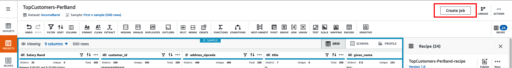
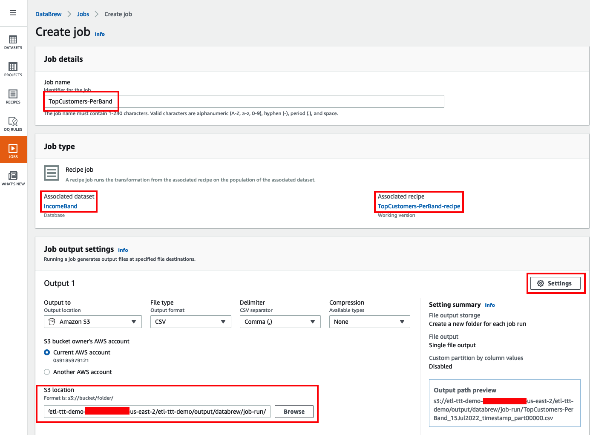
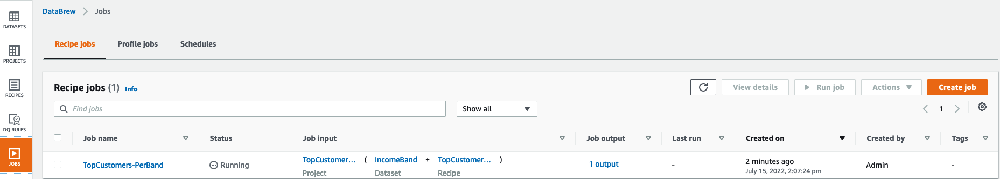
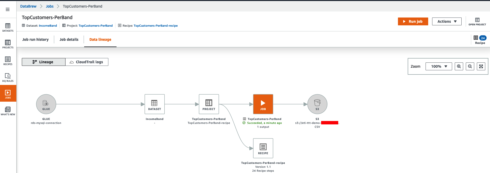
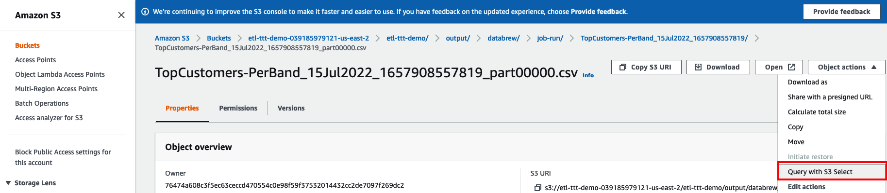
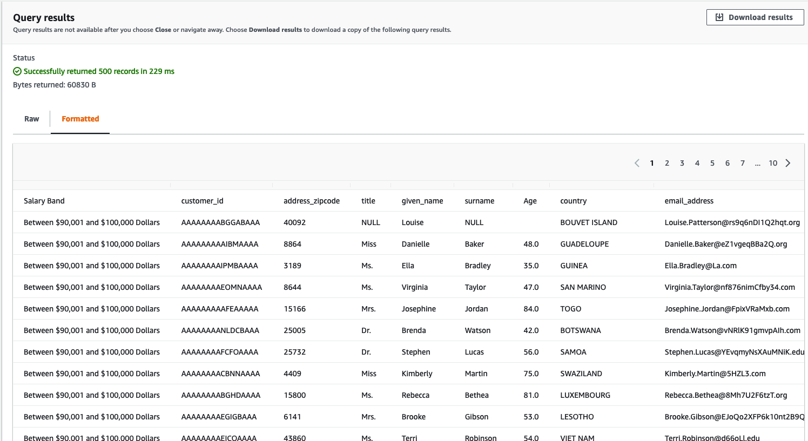

<h1 id="toc_0" align="center">
RUNNING GLUE DATABREW JOBS
</h1>

**DataBrew** takes on the job of transforming your data by running the instructions that you set up when you made a recipe. The process of running these instructions is called a **job**. 

**A job can put your data recipes into action** according to a preset schedule. But you aren't confined to a schedule. You can also **run jobs on demand**. If you want to profile some data, you don't need a recipe. In that case, you can just **set up a profile job to create a data profile**.

#### **6.** Turning projects and recipes into Glue DataBrew jobs
		

The fastest way to turn your project into a job is from the Project page itself. Once all the steps are in place and the recipe is completed you can simply click on the button **Create job** on the upper right top corner.

The **Create job** page will open. There, do the following:

**Set job details:**

&nbsp;&nbsp;&nbsp;&nbsp;&nbsp; **1.** Under **Job details** set the **Job name** to: `TopCustomers-PerBand`

&nbsp;&nbsp;&nbsp;&nbsp;&nbsp; **2.** Under **Job type** confimr that the **Associated dataset** is the **IncomeBand** dataset and the **Associated recipe** is the **TopCustomers-PerBand-recipe**
        

**Job output setting**

&nbsp;&nbsp;&nbsp;&nbsp;&nbsp; **3.** Under Job output settings navigate to the S3 location **s3://\${BUCKET_NAME}/etl-ttt-demo/output/databrew/job-run/** where **\${BUCKET_NAME}** is your own S3 bucket name. 

&nbsp;&nbsp;&nbsp;&nbsp;&nbsp; **4.** Click on the **Settings** button (with a small gear icon). On the pop-up window that appear, under **File Partitioning**, choose the **Single file output** option and click **Save**.

&nbsp;&nbsp;&nbsp;&nbsp;&nbsp; **5.** Keep everything else default here.

**Job role name**

&nbsp;&nbsp;&nbsp;&nbsp;&nbsp; **5.** Under **Permission** select **AWSGlueDataBrewServiceRole-etl-ttt-demo** in **Role name** dropdown list.

&nbsp;&nbsp;&nbsp;&nbsp;&nbsp; **5.** Click **Create and run job**.

**Run job**

Once the job has been created, click the **JOB** icon on the left. Under the **Recipe jobs** tab you will see a new job with name **TopCustomers-PerBand** in the **Running** state. Wait for the job to finish.

**Job lineage**

Once the job finishes, click on the job name. You should see one succeeded job run under **Job run history** tab. Click the **Data linage** tab to see the data linage graph for the job.

You should see a new folder in S3 under **s3://\${BUCKET_NAME}/etl-ttt-demo/output/databrew/job-run/** which contains the output of the job. Go inside this folder and click on the file that starts with **TopCustomers-PerBand_**. Use **S3 Select** to explore the file contents.

Under **Query with S3 Select**, keep **CSV** and **Comma** as the selected options for both **Input settings** and  **Output settings**. Scroll to the **SQL query** section and explore the generated data with the following query:

~~~shell
SELECT * FROM s3object s LIMIT 500
~~~

Click on **Run SQL Query** then scroll to the **Query results** section and choose the **Formatted** tab to see the data in a nice tabular format:

 

<h3 id="toc_0" align="center">
With that, you have concluded all the labs for this workshop. I hope you have enjoyed! Congratulations!!
</h3>
